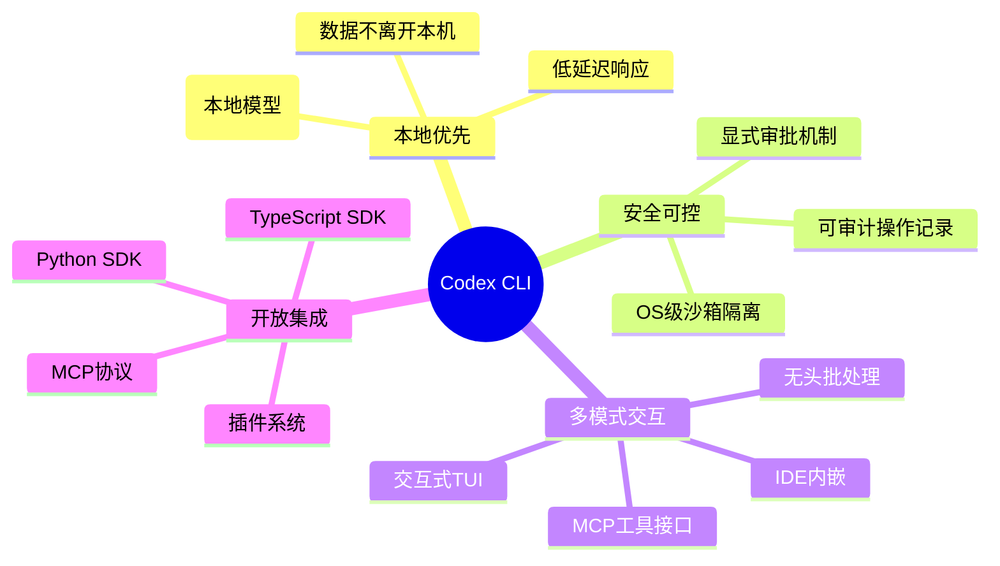
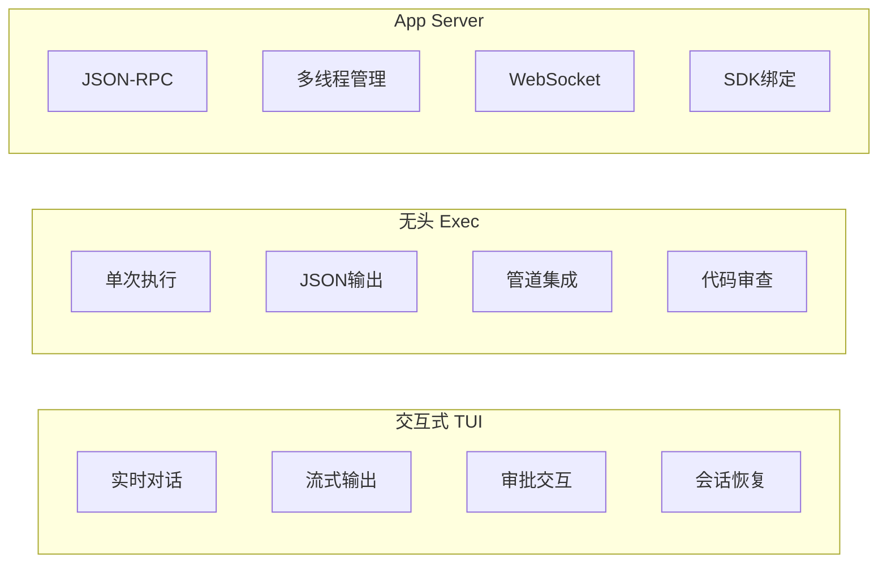
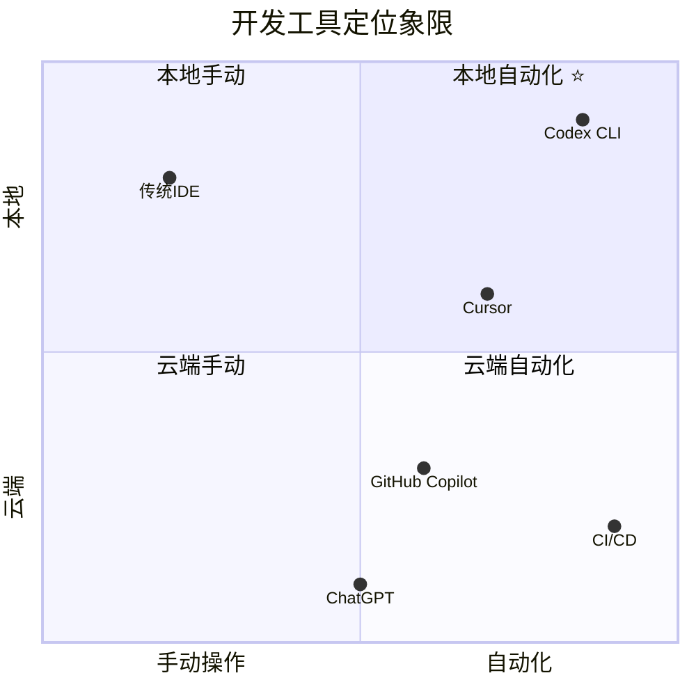
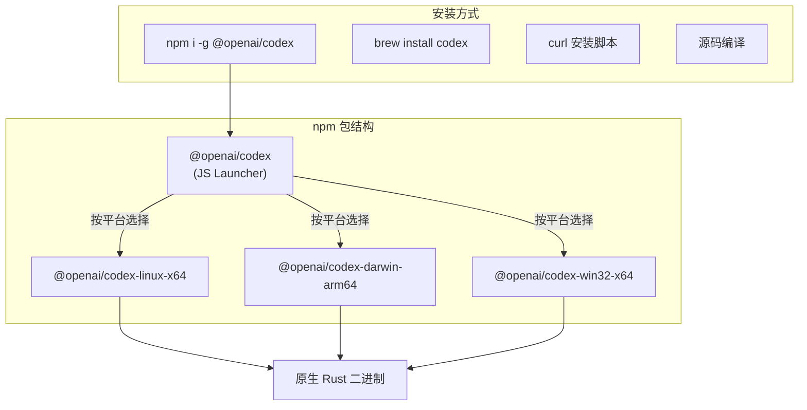
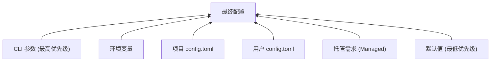

# 01 - 产品概览

## 产品定位

Codex CLI 是 OpenAI 推出的**本地 AI 编程代理**（Local Coding Agent）。它运行在开发者的机器上，能够：

- 阅读和理解代码库
- 编写和修改代码
- 执行 Shell 命令
- 通过 MCP 协议连接外部工具
- 与 IDE 深度集成

### 核心价值主张



## 用户画像

| 用户类型 | 使用场景 | 首选模式 |
|----------|----------|----------|
| **终端开发者** | 日常编码、代码审查、重构 | 交互式 TUI |
| **CI/CD 工程师** | 自动化代码生成、测试、审查 | `codex exec` 无头模式 |
| **IDE 用户** | VS Code / Cursor 内使用 | App Server + SDK |
| **工具开发者** | 构建 AI 驱动的开发工具 | MCP Server / SDK |

## 核心功能矩阵

### 三种运行模式



### 功能详表

| 功能 | 描述 | 实现位置 |
|------|------|----------|
| **代码生成** | 根据自然语言生成代码 | `codex-core` → LLM |
| **代码编辑** | Apply Patch 工具修改文件 | `codex-apply-patch` |
| **Shell 执行** | 在沙箱内运行命令 | `codex-core/tools/shell` |
| **MCP 工具** | 连接外部 MCP 服务器 | `codex-mcp` |
| **代码审查** | `codex review` / `codex exec review` | `codex-exec` |
| **会话管理** | 持久化、恢复、分叉 | `codex-state`, `codex-rollout` |
| **上下文压缩** | 自动/手动上下文窗口管理 | `codex-core/compact` |
| **多模型支持** | OpenAI / Ollama / LM Studio | `codex-model-provider` |
| **插件系统** | 可扩展的工具和行为 | `codex-plugin` |
| **Skills** | 可复用的知识和能力 | `codex-skills` |
| **记忆系统** | 跨会话知识积累 | `codex-memories-*` |

## 产品价值分析

### 与传统开发工具对比



### 核心差异化优势

1. **本地优先 (Local-First)**
   - 代码不上传到云端（使用本地模型时）
   - 完整的文件系统访问（受沙箱控制）
   - 低延迟的命令执行

2. **安全沙箱 (Sandboxed Execution)**
   - OS 级隔离（Seatbelt/bubblewrap/seccomp）
   - 精细的文件系统权限
   - 网络访问控制
   - 操作审批流程

3. **协议开放 (Protocol-First)**
   - MCP 协议双向支持
   - App Server JSON-RPC 协议
   - TypeScript / Python SDK

4. **模式灵活 (Multi-Modal)**
   - TUI 交互 → 日常开发
   - 无头执行 → CI/CD 自动化
   - IDE 集成 → 无缝体验

## 技术栈选择

| 层次 | 技术 | 理由 |
|------|------|------|
| **核心语言** | Rust | 性能、安全、跨平台 |
| **TUI 框架** | Ratatui + Crossterm | 成熟的终端 UI 生态 |
| **异步运行时** | Tokio | Rust 异步标准 |
| **持久化** | SQLite | 轻量、嵌入式、零配置 |
| **配置格式** | TOML | Rust 生态标准 |
| **构建系统** | Cargo + Bazel | 开发效率 + 发布可靠性 |
| **分发** | npm + Homebrew | 覆盖主流安装方式 |
| **协议** | JSON-RPC (lite) | 简单、双向、IDE 友好 |

## 安装与分发



npm 包 `@openai/codex` 是一个**薄启动器**——真正的实现是平台特定的 Rust 编译二进制文件。

## 配置系统

```
~/.codex/
├── config.toml          # 用户级配置
├── instructions.md      # 全局系统指令
├── sessions/            # 会话持久化
├── skills/              # 用户 Skills
├── rules/               # 执行策略规则
└── state.db             # SQLite 状态数据库

<项目>/.codex/
├── config.toml          # 项目级配置
├── instructions.md      # 项目级指令
└── skills/              # 项目 Skills
```

### 配置层叠模型



## 关键指标

| 指标 | 数据 |
|------|------|
| Rust Crate 数量 | 113 |
| 源码文件 (Rust) | ~2000+ |
| 支持平台 | Linux (x64/arm64), macOS (arm64/x64), Windows |
| 沙箱后端 | 3 (Seatbelt, bubblewrap+seccomp, Windows Restricted Token) |
| 模型提供商 | OpenAI, Ollama, LM Studio, 自定义 |
| 协议版本 | App Server v2 (活跃开发) |
