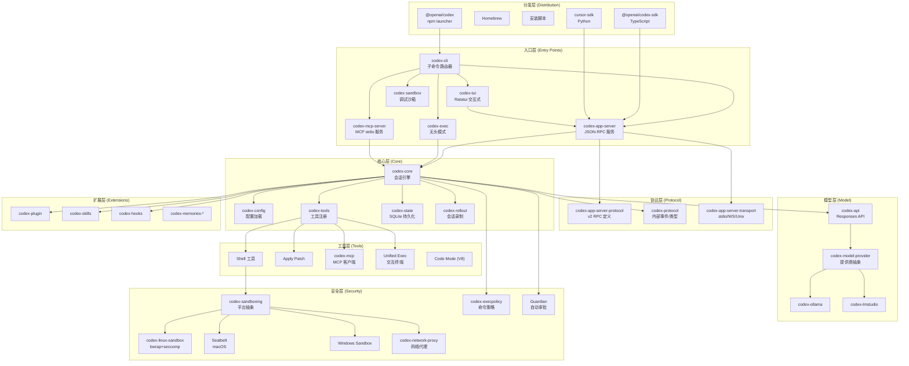
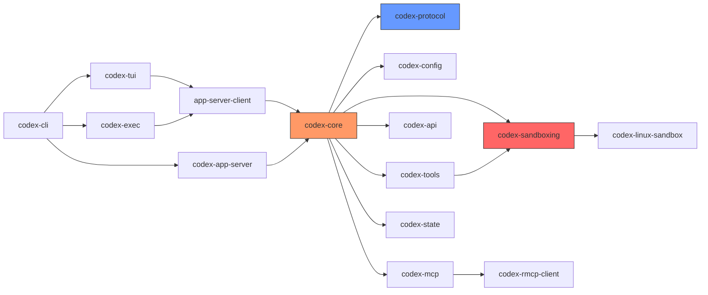
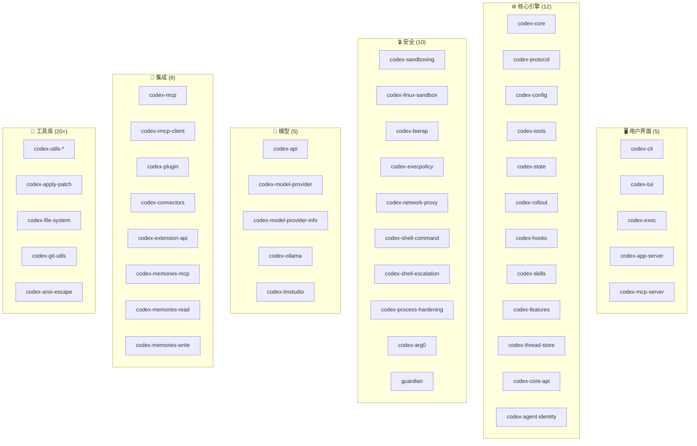
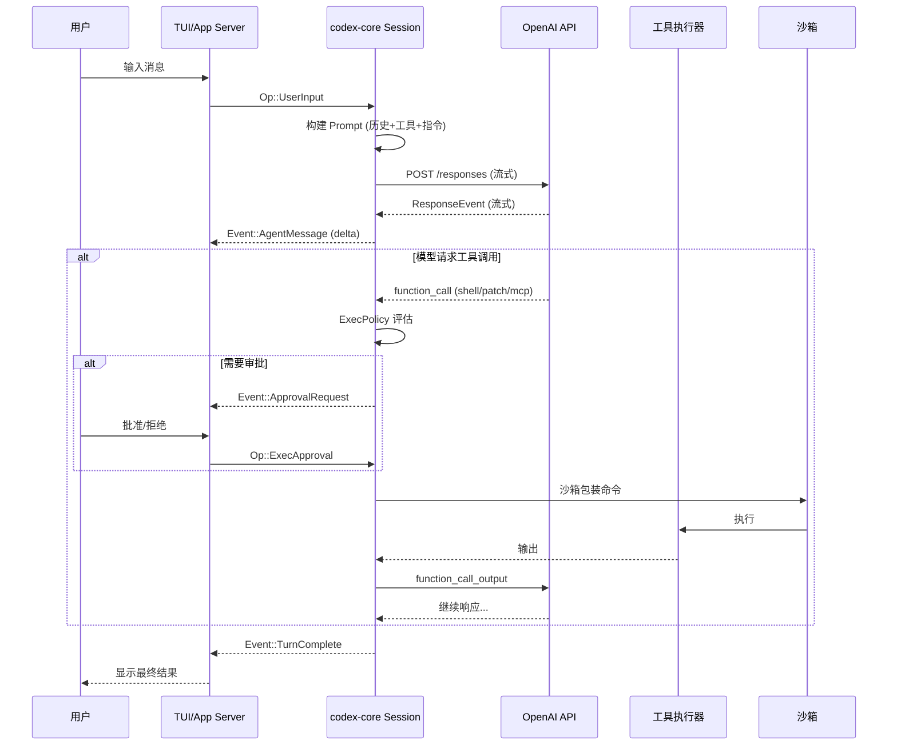
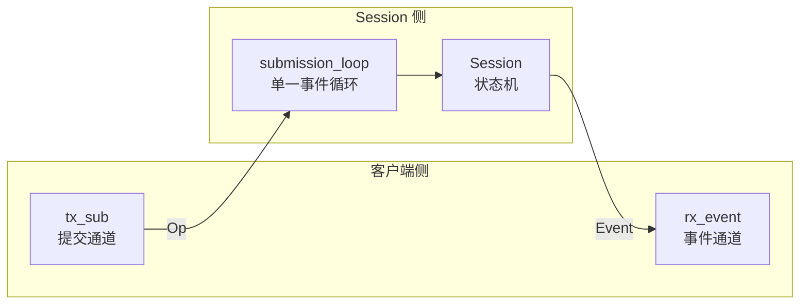
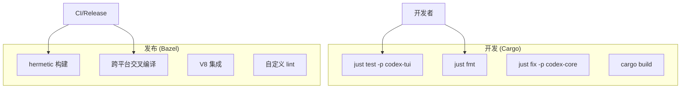
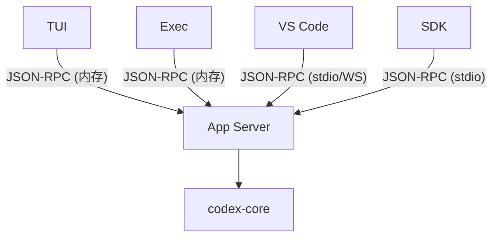

# 02 - 系统架构

## 整体架构图



## Crate 依赖关系

### 核心依赖链



### 按功能分组的 Crate 地图



## 数据流架构

### 用户输入到模型响应



### 会话生命周期

```mermaid
stateDiagram-v2
    [*] --> Created: ThreadManager.start_thread()
    Created --> Configured: SessionConfigured 事件
    Configured --> Idle: 等待用户输入

    Idle --> TurnActive: Op::UserInput
    TurnActive --> ToolExec: 模型请求工具
    ToolExec --> Approval: 需要审批
    Approval --> ToolExec: 用户批准
    ToolExec --> TurnActive: 工具输出 → 模型
    TurnActive --> Idle: TurnComplete

    Idle --> Compacting: Op::Compact
    Compacting --> Idle: ContextCompacted

    TurnActive --> Interrupted: Op::Interrupt
    Interrupted --> Idle: TurnAborted

    Idle --> [*]: Op::Shutdown
```

## 关键设计决策

### 1. Queue-Pair 并发模型



**设计理由**：所有状态变更通过单一提交循环序列化，避免 UI 代码中的锁竞争。客户端（TUI/app-server）通过 channel 对与 Session 通信。

### 2. Session vs Turn 分离

| 层次 | 生命周期 | 状态 |
|------|----------|------|
| `SessionConfiguration` | 整个会话 | 模型、权限、CWD、features |
| `TurnContext` | 单次对话轮次 | 当前模型、环境、覆盖设置 |
| `ActiveTurn` | 活跃执行中 | 任务、审批等待器 |

### 3. 双构建系统



### 4. App Server 中心化



TUI 和 Exec 不直接调用 `codex-core` 的会话 API——它们通过内嵌的 App Server 客户端走标准 JSON-RPC 协议。这确保了：
- 所有客户端的行为一致
- 协议可独立演进
- IDE 集成与终端使用共享相同代码路径

### 5. 沙箱前置

```
默认状态: 沙箱化执行
  ↓ 执行失败 (沙箱拒绝)
  ↓ 检测到权限不足
  ↓ 请求用户审批
  ↓ 批准后: 无沙箱重试
```

安全模型是**先沙箱后升级**，而非先执行后限制。

## 模块职责边界

| 边界 | 左侧 | 右侧 | 接口 |
|------|-------|-------|------|
| 用户 ↔ Agent | TUI/App Server | codex-core | `Op` / `Event` (codex-protocol) |
| Agent ↔ LLM | codex-core | codex-api | `Prompt` / `ResponseStream` |
| Agent ↔ 工具 | codex-core tools | 沙箱/执行器 | `ExecRequest` / `ExecResult` |
| Agent ↔ MCP | codex-core | codex-mcp | MCP JSON-RPC |
| Server ↔ Client | app-server | IDE/SDK | App Server Protocol v2 |
| 安全 ↔ OS | codex-sandboxing | OS syscalls | bwrap/seatbelt/seccomp |

## 目录结构概览

```
codex-rs/
├── cli/                    # 主二进制 (子命令路由)
├── tui/                    # 交互式终端 UI (~318 源文件)
├── exec/                   # 无头执行模式
├── core/                   # 核心引擎 (~358 源文件)
├── protocol/               # 共享类型定义
├── config/                 # 配置加载
├── tools/                  # 工具注册与路由
├── app-server/             # JSON-RPC 服务器
├── app-server-protocol/    # 协议类型 + Schema 生成
├── app-server-transport/   # 传输层 (stdio/WS/Unix)
├── app-server-client/      # 客户端库
├── sandboxing/             # 沙箱平台抽象
├── linux-sandbox/          # Linux 沙箱实现
├── execpolicy/             # 命令策略引擎 (Starlark)
├── network-proxy/          # 网络代理 (SOCKS5/HTTPS MITM)
├── mcp-server/             # MCP 服务端模式
├── codex-mcp/              # MCP 客户端
├── state/                  # SQLite 持久化
├── rollout/                # 会话录制
├── api/                    # OpenAI API 封装
├── model-provider/         # 模型提供商抽象
├── ollama/                 # Ollama 集成
├── lmstudio/               # LM Studio 集成
├── plugin/                 # 插件系统
├── skills/                 # Skills 系统
├── hooks/                  # 生命周期 Hooks
├── memories/               # 记忆管道
├── ext/                    # 扩展 (goal, guardian, memories)
├── utils/                  # 20+ 工具库
├── vendor/                 # 内嵌 bubblewrap
└── docs/                   # 内部文档
```
