# 03 - 核心引擎 (codex-core)

## 概述

`codex-core` 是整个 Codex 的**组合根** (Composition Root)——它不自行实现所有逻辑，而是将沙箱、配置、API 传输、策略引擎等委托给兄弟 Crate，自己负责编排。

> ⚠️ 项目明确要求：**抵制向 codex-core 添加代码**。新功能应优先放入独立 Crate。

## 核心概念模型

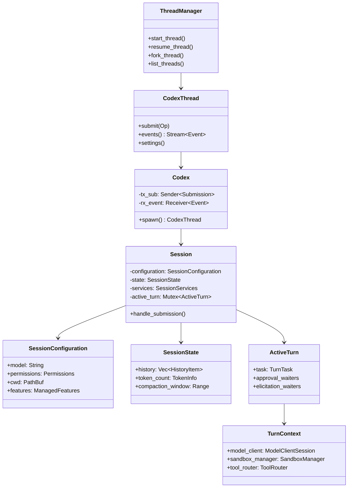

## Session 生命周期

### 创建流程

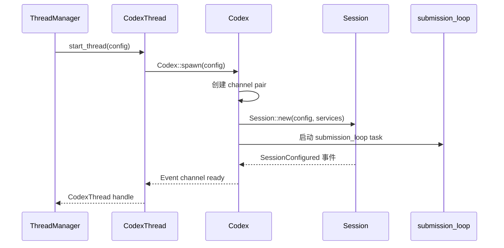

### 提交循环 (submission_loop)

这是 Session 的心脏——一个无限循环处理所有入站操作：

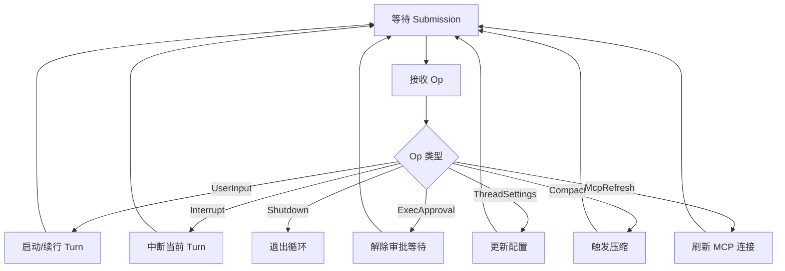

### Turn 执行循环 (run_turn)

这是 Agent 的核心采样循环：

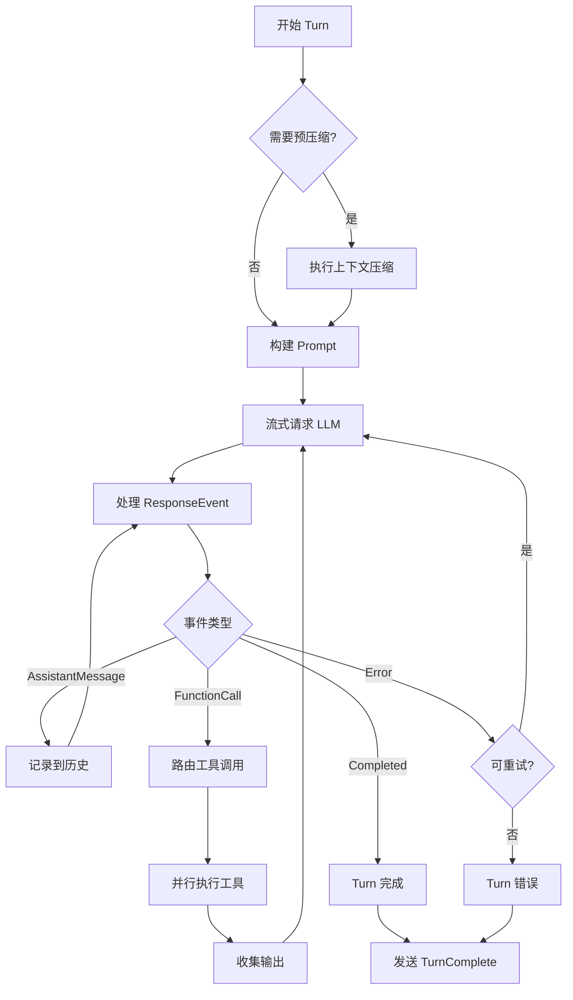

## 配置系统深度解析

### 配置加载流水线

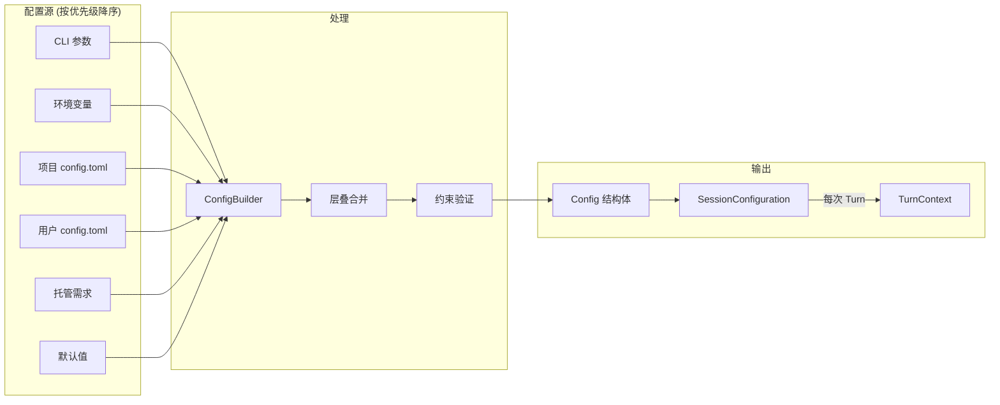

### 关键配置字段

```toml
# ~/.codex/config.toml 示例

model = "o4-mini"
approval_policy = "unless-trusted"

[sandbox]
permissions_profile = ":workspace"

[permissions]
read_file_on_approve = true

[mcp_servers.filesystem]
command = "npx"
args = ["-y", "@modelcontextprotocol/server-filesystem", "/path"]

[hooks.on_turn_complete]
command = "notify-send"
args = ["Codex", "Turn complete!"]
```

## 工具系统

### 工具注册与路由

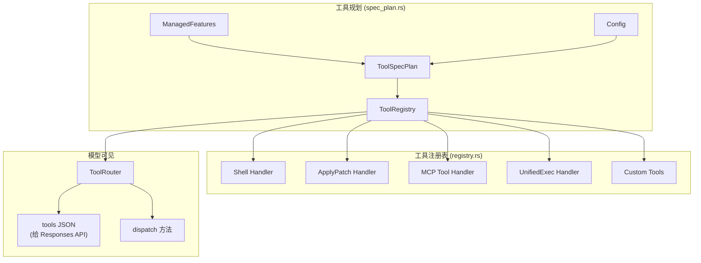

### 工具执行编排 (Orchestrator)

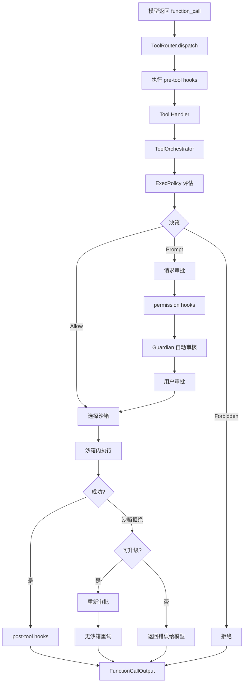

### Shell 工具执行路径

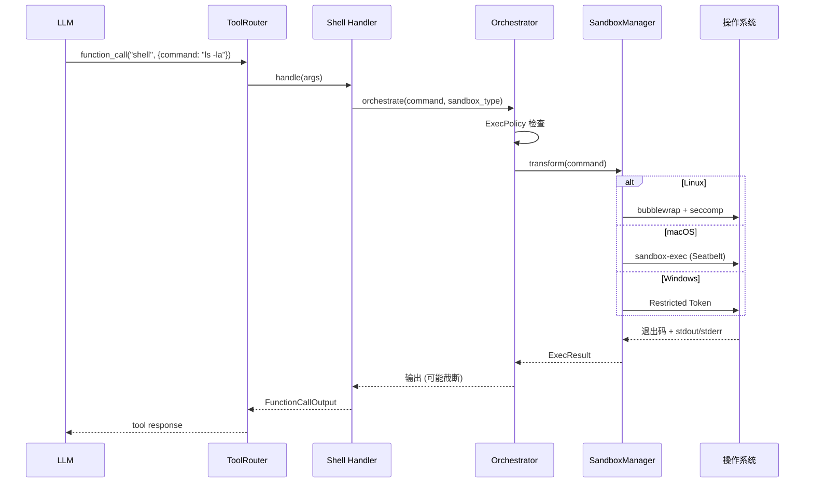

## 事件系统

### 事件类型层次

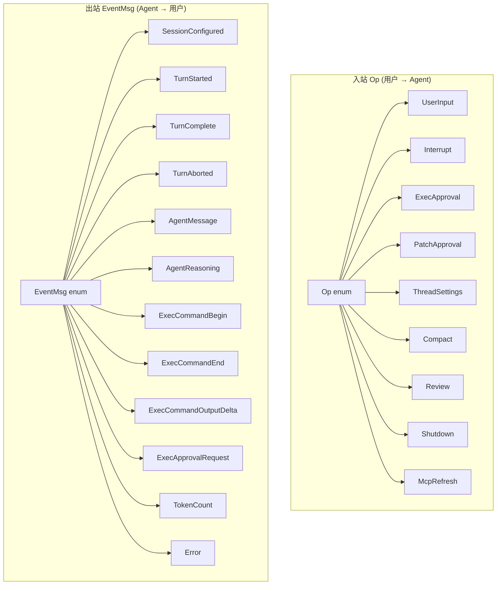

### 事件流转

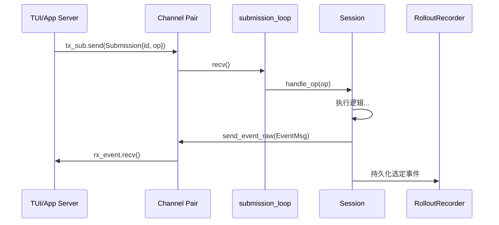

## LLM 交互

### ModelClient 架构

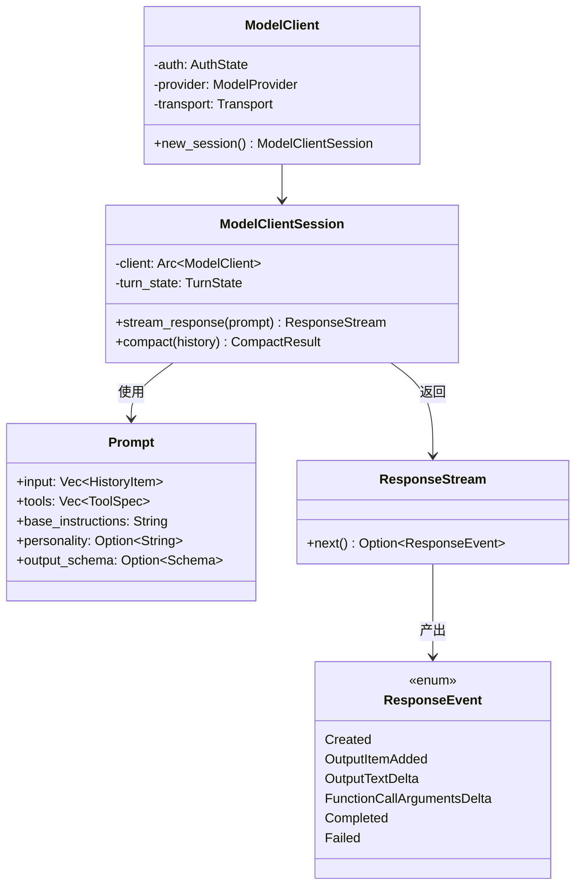

### 请求组装

```mermaid
flowchart LR
    subgraph "输入构建"
        HISTORY[对话历史] --> INPUT
        SYSTEM[系统指令] --> INPUT[Prompt.input]
        CONTEXT[上下文片段] --> INPUT
    end

    subgraph "工具声明"
        TOOLS[ToolRouter.specs()] --> TOOLS_JSON[tools JSON]
    end

    subgraph "元数据"
        MODEL[模型名] --> HEADERS
        TURN_ID[Turn ID] --> HEADERS[请求头]
        THREAD_ID[Thread ID] --> HEADERS
    end

    INPUT --> REQUEST[POST /responses]
    TOOLS_JSON --> REQUEST
    HEADERS --> REQUEST
```

## 上下文管理

### 上下文压缩 (Compaction)

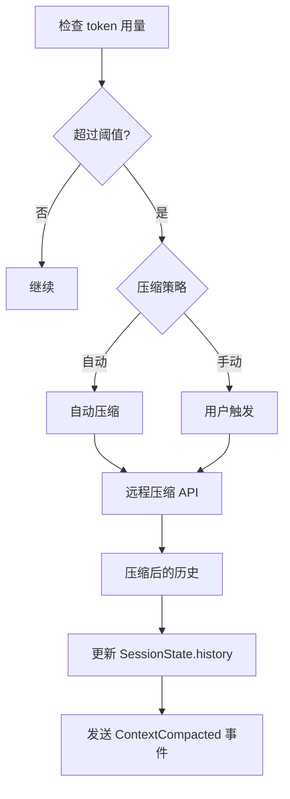

### ContextManager 职责

| 功能 | 说明 |
|------|------|
| 历史记录 | 维护完整对话历史 |
| Token 计数 | 跟踪当前 token 用量 |
| 压缩边界 | 确定可压缩范围 |
| 记忆注入 | 在适当位置插入记忆内容 |
| 引用解析 | 解析记忆引用标记 |

## 多 Agent 系统

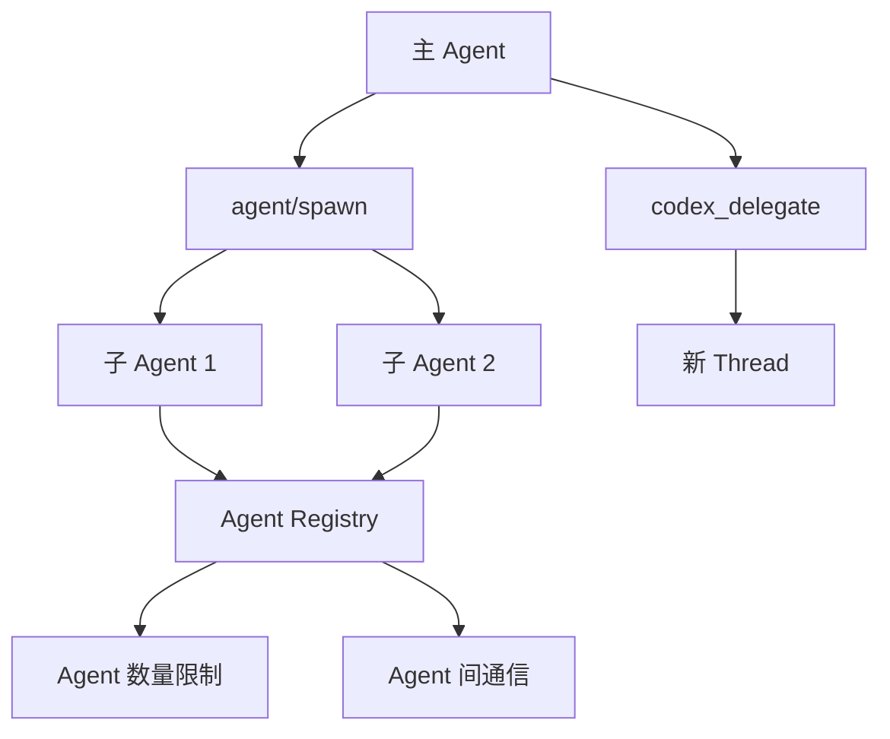

## 错误处理层次

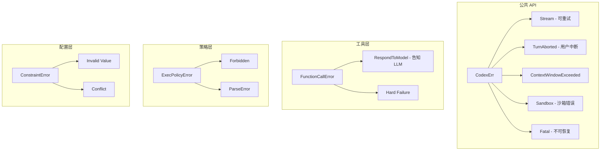

## 关键源文件索引

| 关注点 | 文件路径 | 说明 |
|--------|----------|------|
| 公共 API | `core/src/lib.rs` | re-exports |
| Thread 管理 | `core/src/thread_manager.rs` | 创建/恢复/分叉 |
| Thread 句柄 | `core/src/codex_thread.rs` | 提交/订阅 |
| Session 生成 | `core/src/session/mod.rs` | Queue-pair, spawn |
| Op 分发 | `core/src/session/handlers.rs` | submission_loop 处理 |
| Turn 循环 | `core/src/session/turn.rs` | run_turn, 采样循环 |
| Turn 上下文 | `core/src/session/turn_context.rs` | 每次 turn 的快照 |
| Session 状态 | `core/src/state/session.rs` | 可变历史/token |
| 配置结构 | `core/src/config/mod.rs` | ~3800 LoC |
| LLM 客户端 | `core/src/client.rs` | ModelClient |
| 工具注册 | `core/src/tools/spec_plan.rs` | 条件注册 |
| 工具路由 | `core/src/tools/router.rs` | dispatch |
| 工具编排 | `core/src/tools/orchestrator.rs` | 审批→沙箱→执行 |
| Shell 执行 | `core/src/exec.rs` | 进程执行+输出捕获 |
| 沙箱桥接 | `core/src/sandboxing/mod.rs` | ExecRequest 适配 |
| 策略引擎 | `core/src/exec_policy.rs` | .rules 文件评估 |
| Guardian | `core/src/guardian/` | 自动审批审核器 |
| 事件映射 | `core/src/event_mapping.rs` | ResponseItem → TurnItem |
| 流处理 | `core/src/stream_events_utils.rs` | 流式delta处理 |
| 压缩 | `core/src/compact.rs` | 上下文压缩 |
| MCP | `core/src/mcp.rs` | MCP 服务器解析 |
| 子 Agent | `core/src/agent/` | 多 agent 控制 |
| Hooks | `core/src/hook_runtime.rs` | 用户 hooks 执行 |
