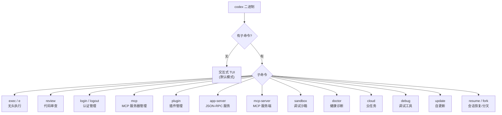
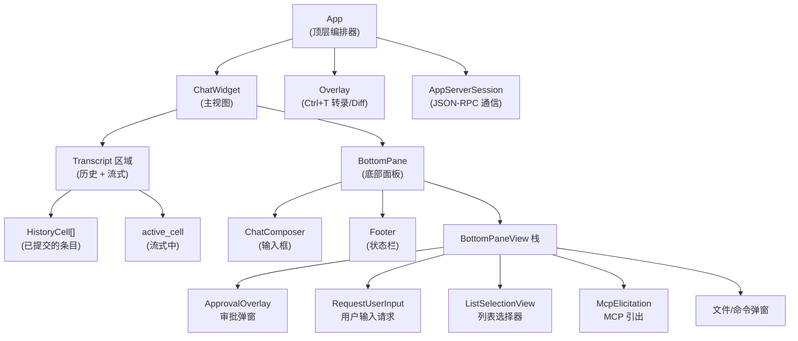
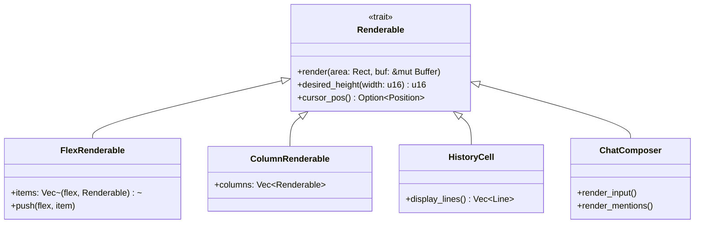
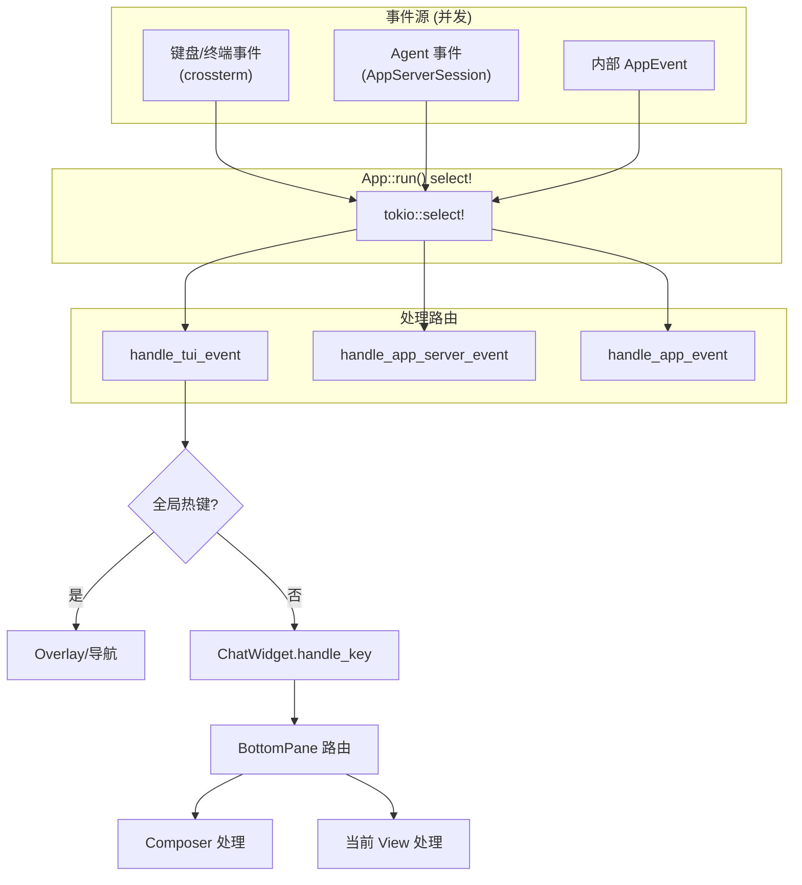
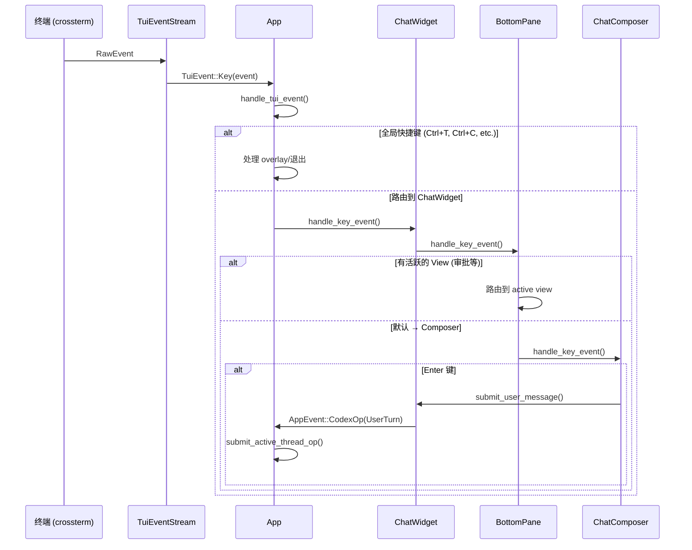
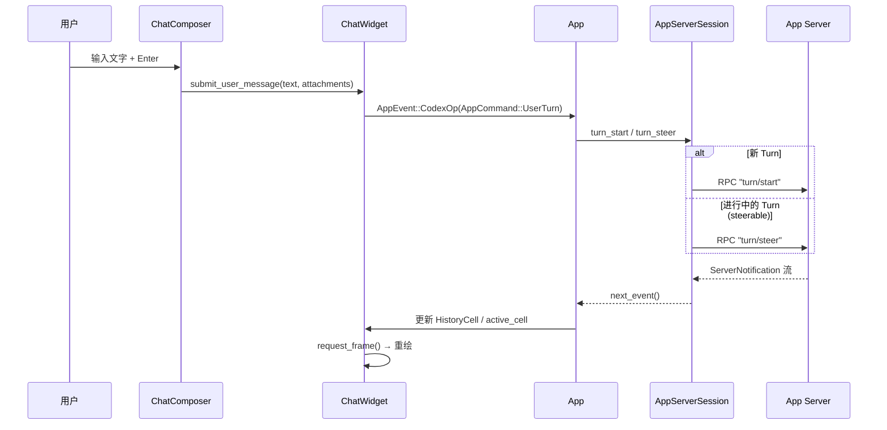
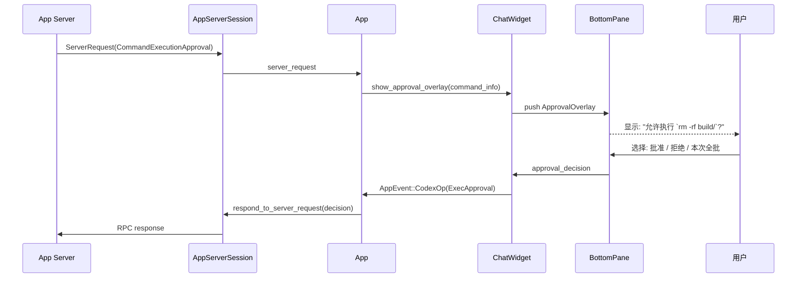
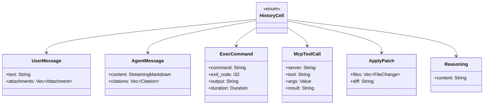

# 04 - TUI 与 CLI

## CLI 架构 (codex-cli)

### 子命令路由

`codex` 二进制是一个多工具路由器 (MultitoolCli)：



### 共享选项

| 选项 | 作用 | 适用范围 |
|------|------|----------|
| `-m/--model` | 模型覆盖 | TUI + Exec |
| `-s/--sandbox` | 沙箱模式 | TUI + Exec |
| `--yolo` | 跳过审批和沙箱 | TUI + Exec |
| `-p/--profile` | 配置 profile | 全局 |
| `-C/--cd` | 工作目录 | TUI + Exec |
| `-i/--image` | 附加图片 | TUI + Exec |
| `--oss` | 开源本地模型 | TUI + Exec |
| `-c key=value` | 配置覆盖 | 全局 |
| `--enable/--disable` | Feature flags | 全局 |

### Exec 模式特有选项

| 选项 | 作用 |
|------|------|
| `--json` | JSONL 事件流输出 |
| `-o/--output-last-message` | 写最终消息到文件 |
| `--output-schema` | 结构化输出 Schema |
| `--ephemeral` | 不持久化 |
| `--skip-git-repo-check` | 允许在非 git 目录运行 |

## TUI 架构 (codex-tui)

### Widget 层次结构



### 渲染系统

TUI 使用自定义 `Renderable` trait 构建可组合的渲染树：



**布局模型**：

```
┌──────────────────────────────────┐
│  Transcript (flex: 1)            │  ← 弹性增长
│  - HistoryCell (用户消息)        │
│  - HistoryCell (Agent 回复)      │
│  - HistoryCell (命令执行)        │
│  - active_cell (流式中...)       │
├──────────────────────────────────┤
│  Hook Output (flex: 0)           │  ← 固定
├──────────────────────────────────┤
│  BottomPane (flex: 0)            │  ← 固定
│  ┌──────────────────────────────┐│
│  │ ChatComposer / Approval      ││
│  ├──────────────────────────────┤│
│  │ Footer (状态行)              ││
│  └──────────────────────────────┘│
└──────────────────────────────────┘
```

### 事件处理架构



### 键盘输入流



### 提交消息流



### 审批交互流



## HistoryCell 类型

转录区域由不同类型的 HistoryCell 组成：



## Exec 模式架构

### 执行流程

```mermaid
flowchart TD
    START[启动] --> PARSE[解析 CLI / stdin]
    PARSE --> CONFIG[加载配置]
    CONFIG --> CLIENT[创建 InProcessAppServerClient]
    CLIENT --> THREAD[thread/start 或 thread/resume]
    THREAD --> TURN[turn/start (UserInput)]

    TURN --> LOOP[事件循环]
    LOOP --> EVENT{事件类型}

    EVENT -->|ItemStarted| PROC[EventProcessor]
    EVENT -->|TurnCompleted| DONE[完成]
    EVENT -->|ServerRequest| REJECT[自动拒绝]
    EVENT -->|Error| FAIL[失败退出]

    PROC --> FORMAT{输出格式}
    FORMAT -->|human| STDERR[stderr 进度 + stdout 结果]
    FORMAT -->|json| JSONL[stdout JSONL 流]

    DONE --> EXIT[退出]
```

### 输出模式对比

| 特性 | Human 模式 | JSON 模式 |
|------|-----------|-----------|
| 进度信息 | stderr (spinner) | 无 |
| Agent 消息 | stdout (最终) | stdout JSONL |
| 工具执行 | stderr (简要) | stdout JSONL (详细) |
| 退出码 | 0=成功, 1=错误 | 0=成功, 1=错误 |
| 适用场景 | 人工使用 | 管道/CI |

### JSONL 事件 Schema

```json
{"type": "message", "role": "assistant", "content": "..."}
{"type": "function_call", "name": "shell", "arguments": "..."}
{"type": "function_call_output", "output": "..."}
{"type": "error", "message": "..."}
```

## TUI 样式系统

### Ratatui Stylize 约定

```rust
// 推荐：使用 Stylize trait helpers
"text".dim()
"text".red()
"text".cyan().underlined()
vec!["M".red(), " ".dim(), "file.rs".dim()].into()

// 避免：手动构造 Style
Span::styled("text", Style::default().fg(Color::Red))
```

### 文本换行

```rust
// 纯文本：使用 textwrap
textwrap::wrap(text, width);

// ratatui Line：使用 wrapping.rs helpers
word_wrap_lines(&lines, width);
word_wrap_line(&line, width);
```

## 快照测试

TUI 使用 `insta` 进行快照测试，验证渲染输出：

```bash
# 运行测试，生成新快照
just test -p codex-tui

# 查看待审查快照
cargo insta pending-snapshots -p codex-tui

# 接受所有新快照
cargo insta accept -p codex-tui
```

每个影响 UI 的变更都必须包含对应的 insta 快照覆盖。
