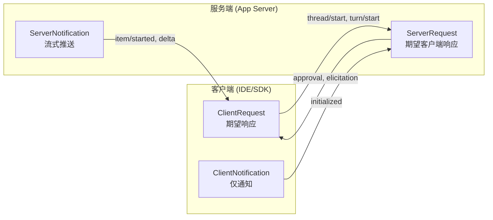
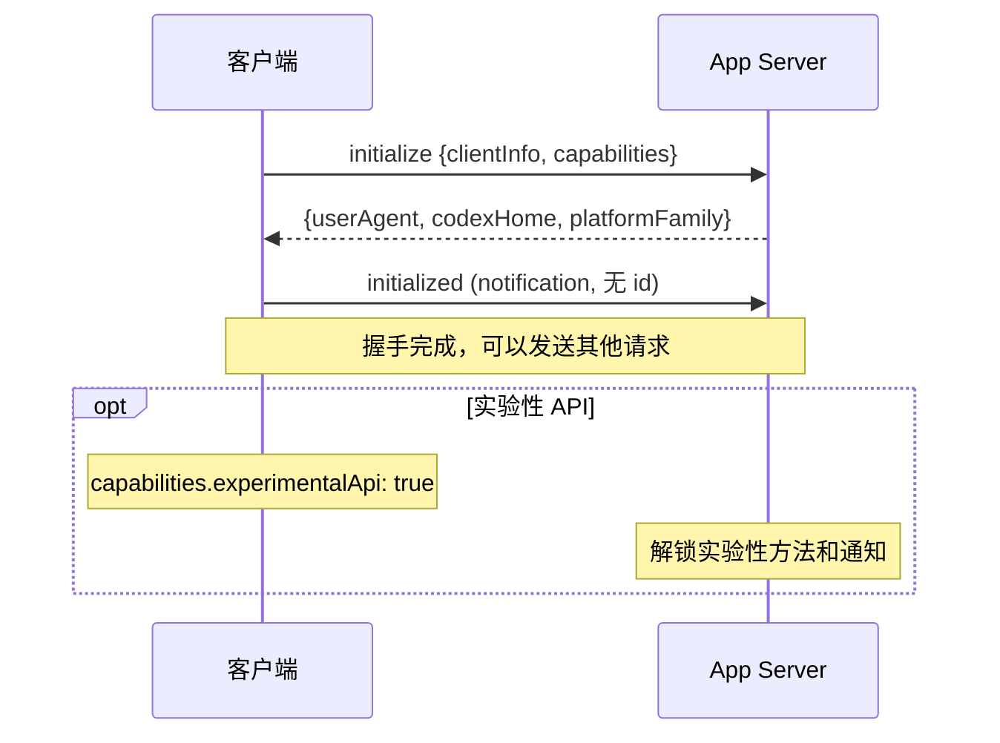
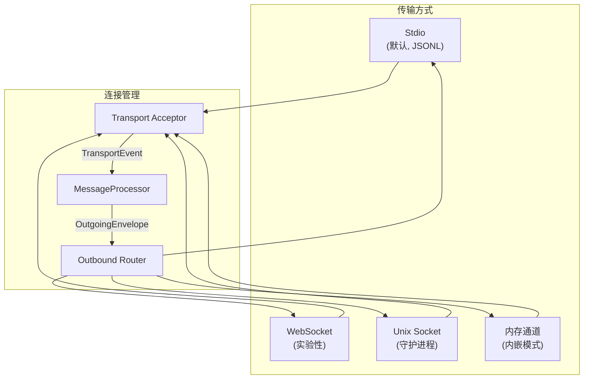
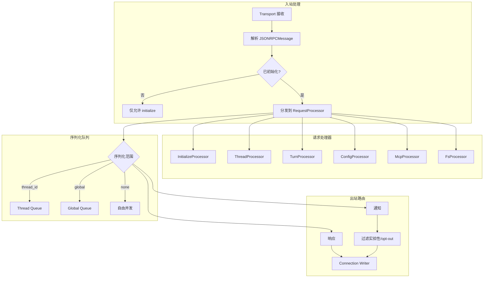
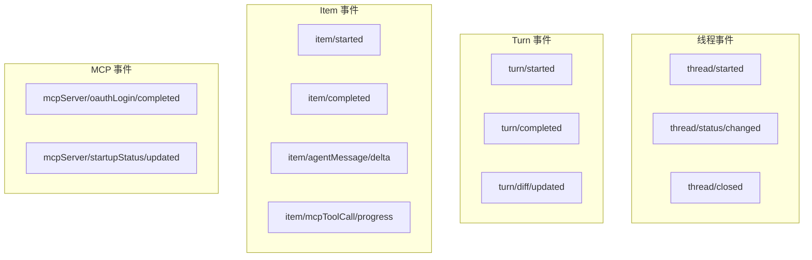
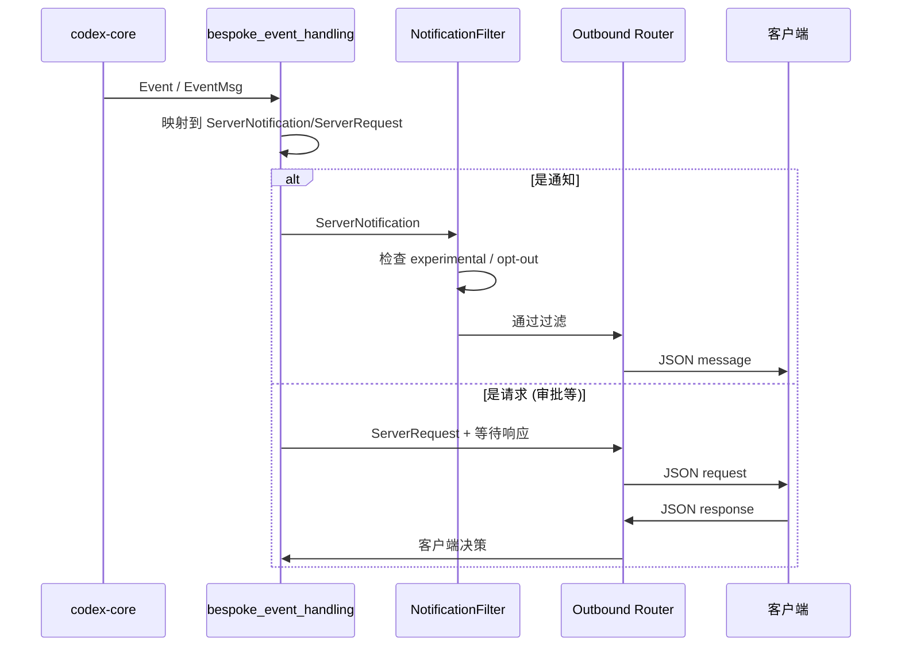
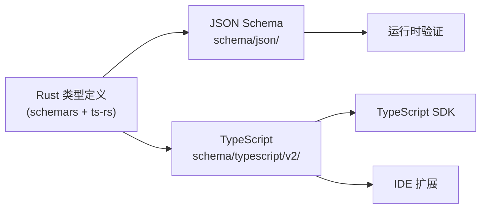
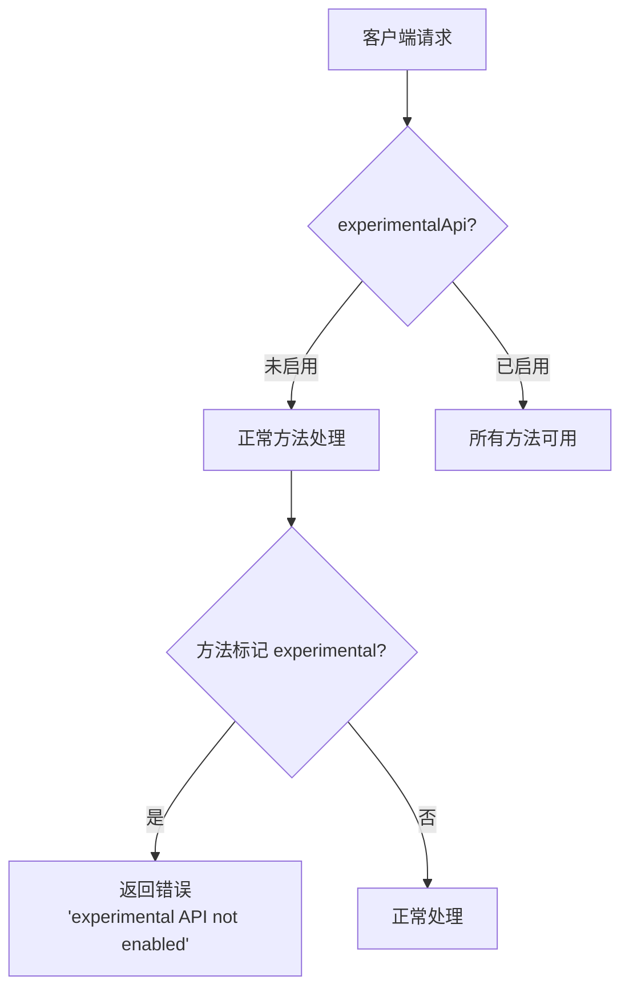
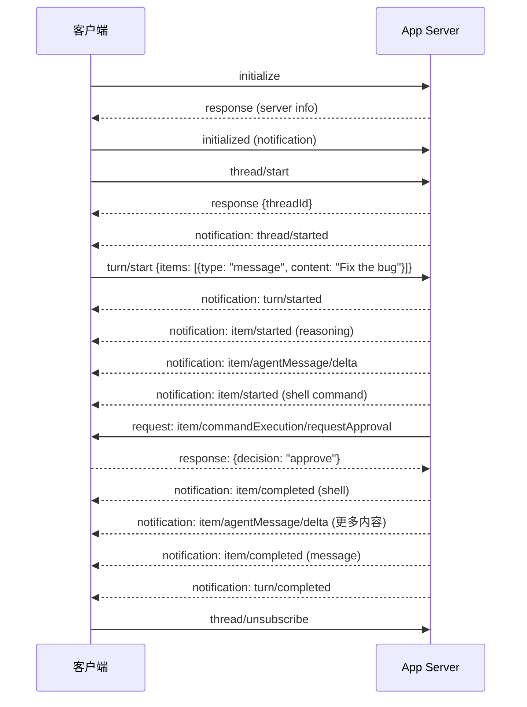

# 05 - App Server 协议

## 协议概述

App Server 使用**精简版 JSON-RPC**协议（省略 `"jsonrpc": "2.0"` 字段），支持双向通信：



## 初始化握手



## 传输层



### 传输编码

| 传输 | 编码 | 适用场景 |
|------|------|----------|
| Stdio | 换行分隔 JSON (JSONL) | CLI 嵌入、SDK |
| WebSocket | 每帧一个 JSON 消息 | IDE 远程连接 |
| Unix Socket | HTTP Upgrade → WS | 本地守护进程 |
| 内存通道 | Rust channel (零序列化) | TUI/Exec 内嵌 |

### WebSocket 安全

- 拒绝带 `Origin` 头的请求 (防止浏览器 CSRF)
- 非 loopback 监听需要认证 (`capability-token` 或 `signed-bearer-token`)
- 背压：channel 容量 128，满时返回 `-32001` 错误

## 服务器架构



## RPC 方法目录

### 线程管理

| 方法 | 方向 | 说明 |
|------|------|------|
| `thread/start` | C→S | 创建新线程 |
| `thread/resume` | C→S | 恢复已有线程 |
| `thread/fork` | C→S | 分叉线程 |
| `thread/list` | C→S | 列出线程 |
| `thread/read` | C→S | 读取线程详情 |
| `thread/archive` | C→S | 归档线程 |
| `thread/unsubscribe` | C→S | 取消订阅事件 |
| `thread/compact/start` | C→S | 触发上下文压缩 |
| `thread/rollback` | C→S | 回滚到某个点 |

### Turn 操作

| 方法 | 方向 | 说明 |
|------|------|------|
| `turn/start` | C→S | 开始新的对话轮次 |
| `turn/steer` | C→S | 在活跃 turn 中追加输入 |
| `turn/interrupt` | C→S | 中断当前 turn |
| `review/start` | C→S | 开始代码审查 |

### 配置与账户

| 方法 | 方向 | 说明 |
|------|------|------|
| `config/read` | C→S | 读取配置 |
| `config/value/write` | C→S | 写入单个配置值 |
| `config/batchWrite` | C→S | 批量写入配置 |
| `account/login/start` | C→S | 开始登录流程 |
| `account/read` | C→S | 读取账户信息 |
| `account/rateLimits/read` | C→S | 读取速率限制 |

### MCP 管理

| 方法 | 方向 | 说明 |
|------|------|------|
| `mcpServer/oauth/login` | C→S | MCP 服务器 OAuth |
| `config/mcpServer/reload` | C→S | 重载 MCP 配置 |
| `mcpServerStatus/list` | C→S | MCP 服务器状态列表 |
| `mcpServer/resource/read` | C→S | 读取 MCP 资源 |
| `mcpServer/tool/call` | C→S | 直接调用 MCP 工具 |

### 文件系统

| 方法 | 方向 | 说明 |
|------|------|------|
| `fs/read` | C→S | 读取文件 |
| `fs/write` | C→S | 写入文件 |
| `fs/list` | C→S | 列出目录 |

## 服务器推送

### 通知 (ServerNotification)



### 服务器请求 (需要客户端响应)

| 请求方法 | 说明 | 典型响应 |
|----------|------|----------|
| `item/commandExecution/requestApproval` | 命令执行审批 | approve/deny |
| `item/fileChange/requestApproval` | 文件变更审批 | approve/deny |
| `item/tool/requestUserInput` | 请求用户输入 | text response |
| `mcpServer/elicitation/request` | MCP 引出请求 | form data |
| `item/permissions/requestApproval` | 权限请求审批 | approve/deny |
| `item/tool/call` | 动态工具调用 | tool result |
| `account/chatgptAuthTokens/refresh` | Auth token 刷新 | new tokens |

## 线程事件管道



## 序列化与类型生成

### 双格式输出



### 类型命名约定

| 类型 | 命名规则 | 示例 |
|------|----------|------|
| 请求参数 | `*Params` | `ThreadStartParams` |
| 响应 | `*Response` | `ThreadStartResponse` |
| 通知 | `*Notification` | `TurnCompletedNotification` |
| 线上字段 | camelCase | `threadId`, `clientInfo` |
| 配置字段 | snake_case | `config_key` |

### Serde 注解约定

```rust
// 标准类型
#[derive(Serialize, Deserialize, JsonSchema, TS)]
#[serde(rename_all = "camelCase")]
#[ts(export_to = "v2/")]
pub struct ExampleParams {
    pub thread_id: String,
    #[ts(optional = nullable)]  // 仅用于 C→S 请求参数
    pub cursor: Option<String>,
}

// 区分联合体 (Discriminated Union)
#[derive(Serialize, Deserialize)]
#[serde(tag = "type")]
#[ts(tag = "type")]
pub enum ItemKind {
    Message { content: String },
    Command { command: String },
}
```

## v1 vs v2

| 特性 | v1 (遗留) | v2 (活跃) |
|------|-----------|-----------|
| 状态 | 仅维护 | 活跃开发 |
| 方法命名 | PascalCase enum | `resource/method` 字符串 |
| 类型导出 | 无 | JSON Schema + TypeScript |
| 新增 API | 禁止 | 首选位置 |
| 分页 | 无标准 | cursor 分页 |

## 实验性 API 门控



标记方式：

```rust
#[experimental("thread/realtime/start")]
ThreadRealtimeStart => "thread/realtime/start" { ... }
```

## 连接会话状态

每个连接维护：

- `ConnectionRpcGate` — 追踪进行中的 ServerRequest
- `experimental_api_enabled` — 是否启用实验性 API
- `opted_out_notification_methods` — 客户端不想接收的通知
- `client_name` / `client_version` — 客户端标识

## 典型交互序列

### 完整对话流


