# 06 - 安全与沙箱

## 安全模型概览

Codex 采用**纵深防御** (Defense-in-Depth) 安全模型：

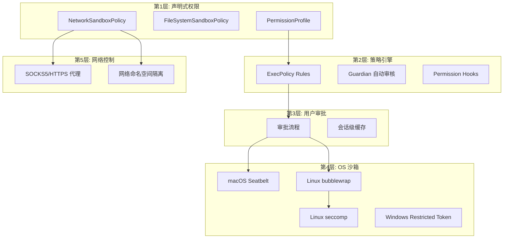

## 权限模型

### PermissionProfile 类型

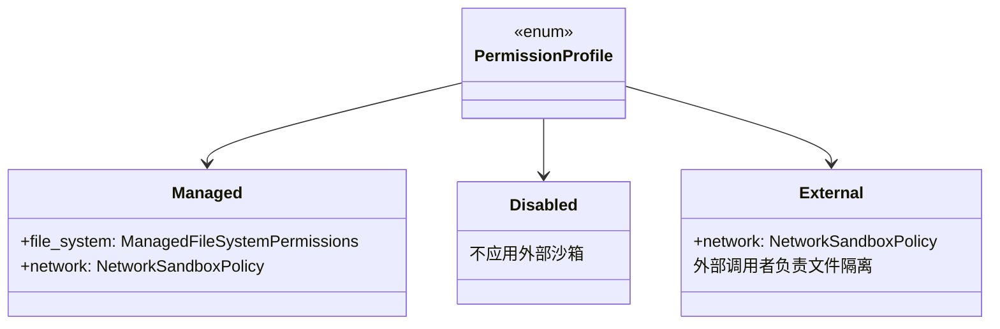

### 内置 Profile 预设

| Profile | 文件系统 | 网络 | 适用场景 |
|---------|----------|------|----------|
| `:read-only` | 只读 | 受限 | 代码分析、审查 |
| `:workspace` | 工作区可写 | 受限 | 日常开发 |
| `:danger-full-access` | 完全访问 | 完全访问 | `--yolo` 模式 |

### 文件系统策略详解

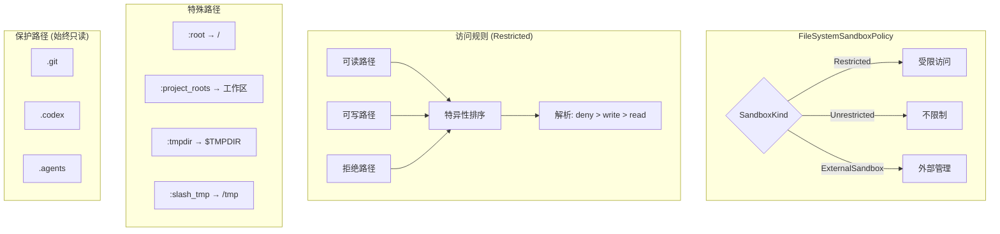

### 权限冲突解析

```
规则: deny > write > read
特异性: 更具体的路径优先

示例:
  /repo          → write (工作区)
  /repo/.git     → read-only (保护)
  /repo/a        → deny
  /repo/a/b      → write (更具体)

结果:
  /repo/file.rs  → 可写 ✓
  /repo/.git/    → 只读 (强制保护)
  /repo/a/x      → 拒绝 ✗
  /repo/a/b/y    → 可写 ✓ (特异性覆盖)
```

## 沙箱实现

### 平台沙箱对比

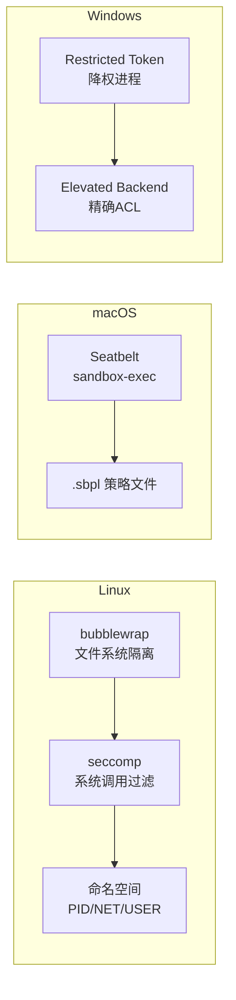

### Linux 沙箱 (bubblewrap + seccomp)

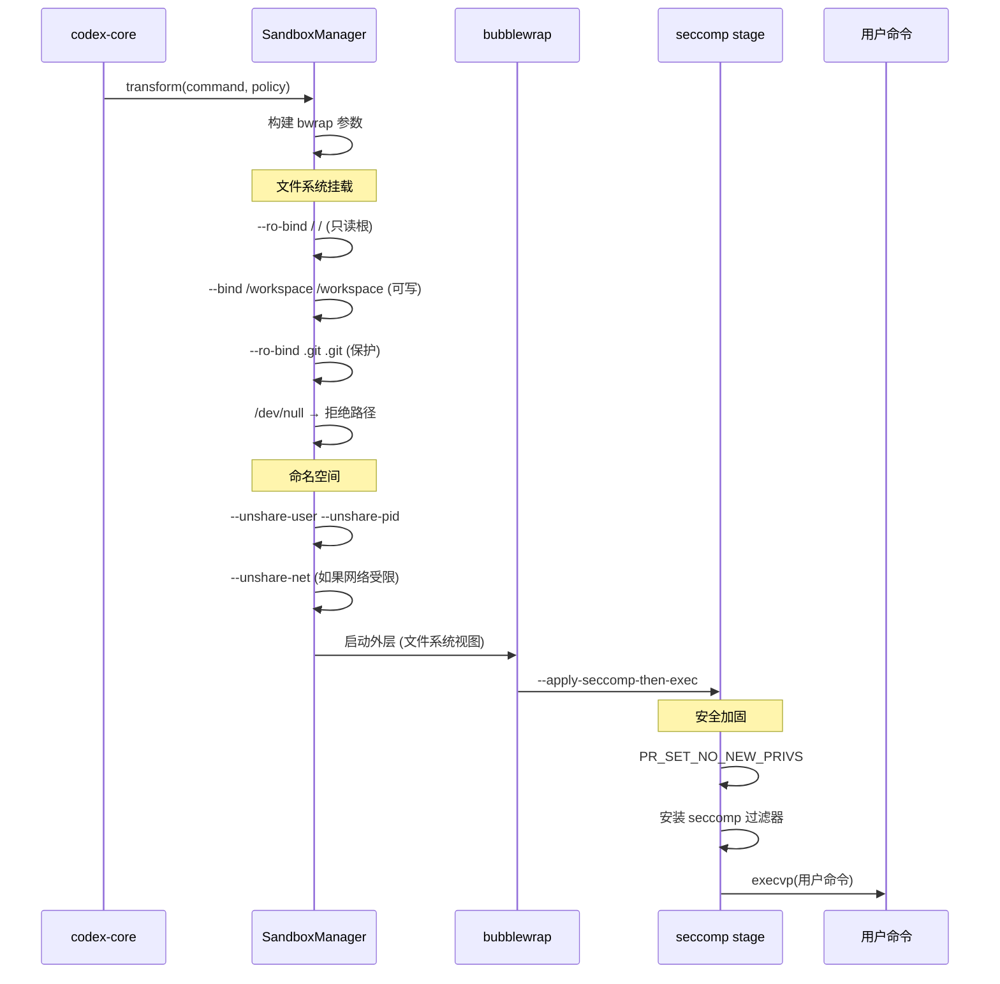

### seccomp 过滤策略

| 模式 | 允许 | 阻止 | 用途 |
|------|------|------|------|
| **Restricted** | AF_UNIX 套接字 | connect, bind, listen (网络) | 默认网络限制 |
| **ProxyRouted** | AF_INET/AF_INET6 | AF_UNIX (除预批) | 强制流量走代理 |
| **通用** | - | ptrace, io_uring, process_vm_* | 所有模式 |

### macOS Seatbelt

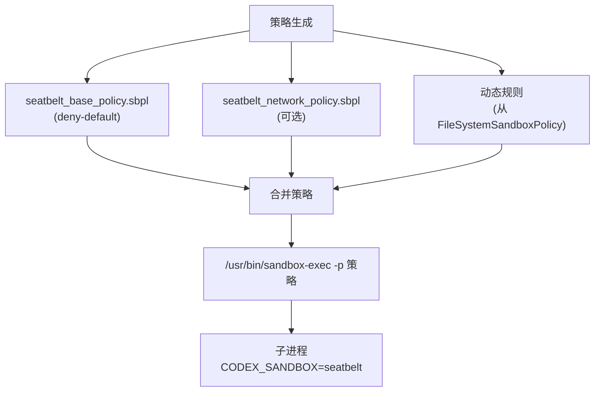

Seatbelt 基础策略允许：
- 进程 exec/fork
- PTY 操作
- cfprefs 读取
- 基本 sysctl

### 保护路径机制

所有平台统一保护以下路径不被 Agent 写入：

```
.git/          → 防止仓库篡改
.codex/        → 防止配置注入 (权限提升)
.agents/       → 防止规则篡改
gitdir: 引用    → 防止 worktree git 篡改
```

## 审批系统

### 审批流程

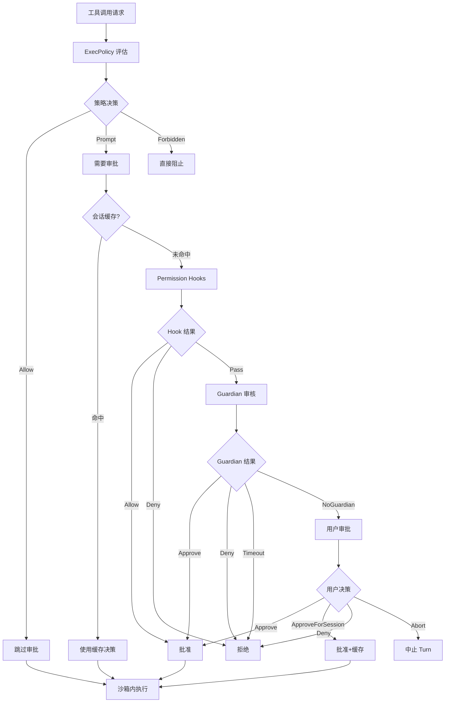

### AskForApproval 策略

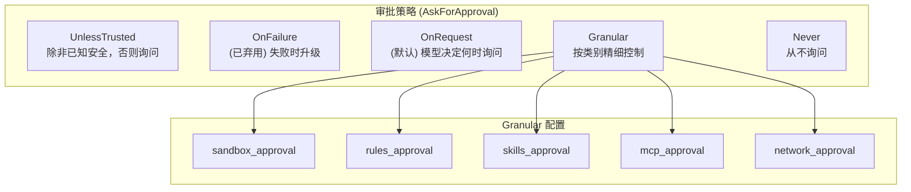

### Guardian 自动审核

Guardian 是一个内置的 LLM 审核器，用于自动判断操作安全性：

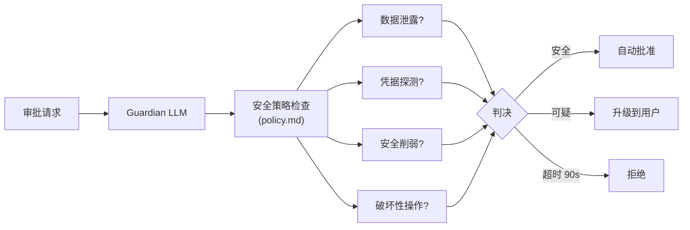

## ExecPolicy 策略引擎

### 规则文件格式

```starlark
# ~/.codex/rules/default.rules
# Starlark 语法的前缀规则匹配

allow("git status")
allow("git diff")
allow("git log")
allow("ls")
allow("cat")

prompt("rm")
prompt("git push")
prompt("curl")

forbid("rm -rf /")
forbid("sudo")
```

### 评估流程

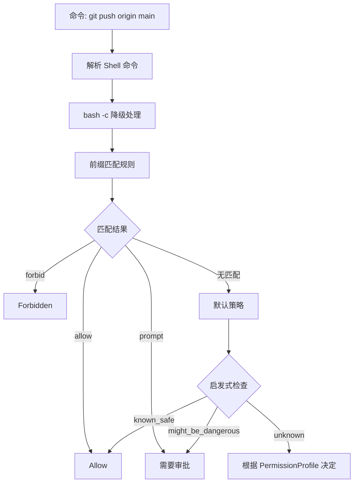

## 沙箱失败与升级

### 升级流程

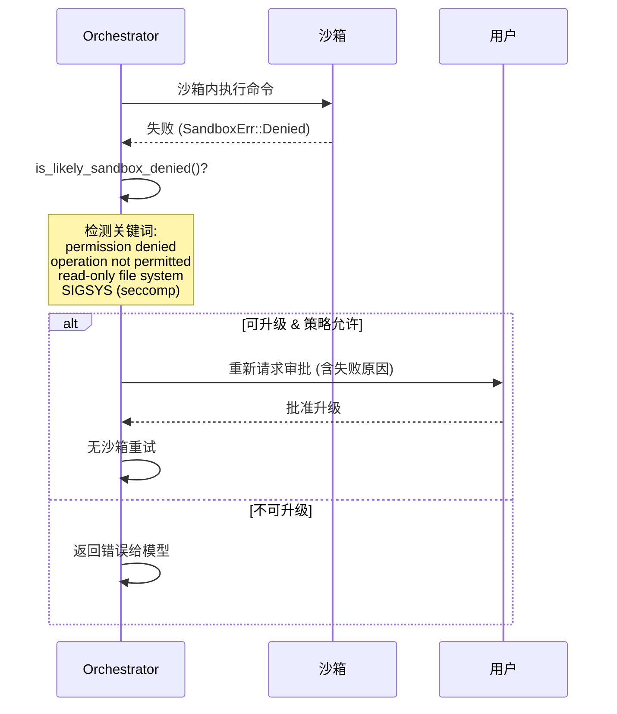

### 沙箱拒绝检测

检测以下信号判断是否为沙箱拒绝：

| 平台 | 信号 |
|------|------|
| 通用 | "operation not permitted", "permission denied" |
| 通用 | "read-only file system" |
| Linux | SIGSYS (exit code 159), "seccomp", "landlock" |
| macOS | "sandbox" in stderr |
| 排除 | exit codes 2, 126, 127 (正常命令错误) |

## 网络安全

### 网络限制层次

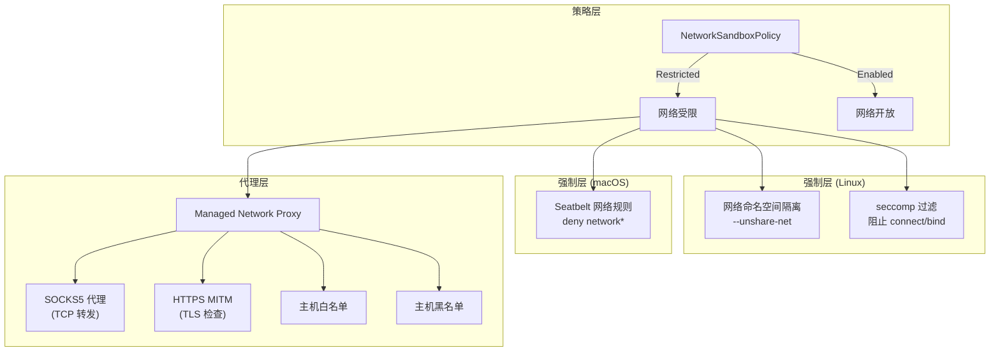

### 托管网络代理

当 `has_managed_network_requirements = true` 时：

1. 启动内部网络代理
2. 所有沙箱内流量被路由到代理
3. 代理按白名单决定放行/拒绝
4. 即使 `DangerFullAccess` profile 也强制代理
5. 用户可持久化 allow/deny 规则

## 环境标记

| 环境变量 | 含义 | 设置时机 |
|----------|------|----------|
| `CODEX_SANDBOX=seatbelt` | macOS Seatbelt 沙箱中 | 子进程 |
| `CODEX_SANDBOX_NETWORK_DISABLED=1` | 网络已禁用 | 子进程 + 测试 |
| `CODEX_LINUX_SANDBOX_WORKSPACE_ROOT` | Linux 沙箱工作区根 | bwrap 内 |

测试中利用这些标记来跳过无法在沙箱中运行的测试。

## 安全设计原则

1. **Fail-Closed** — 默认拒绝，异常情况（Guardian 超时等）也拒绝
2. **先沙箱后升级** — 总是先在沙箱中尝试，失败后才请求升级
3. **保护不可逆操作** — `.git`、`.codex` 等关键路径永远受保护
4. **分层校验** — 策略引擎 → Hooks → Guardian → 用户，任一层可阻止
5. **会话级缓存** — 批准决策在会话内缓存，避免重复打扰
6. **最小权限** — seccomp 阻止不需要的系统调用 (ptrace, io_uring)
