# 07 - MCP 集成

## MCP 在 Codex 中的三种角色

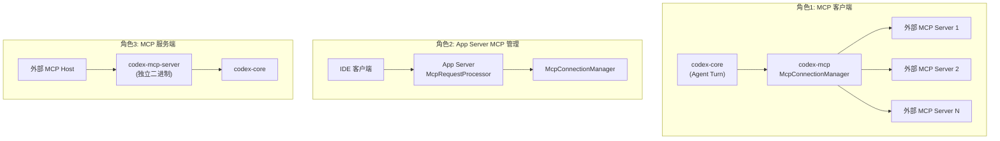

| 角色 | Crate | 协议 | 说明 |
|------|-------|------|------|
| MCP 客户端 | `codex-mcp` | MCP JSON-RPC | Agent 调用外部 MCP 工具 |
| MCP 管理 API | `codex-app-server` | App Server Protocol | IDE 管理 MCP 服务器 |
| MCP 服务端 | `codex-mcp-server` | MCP JSON-RPC (stdio) | 外部系统调用 Codex |

## 角色1: MCP 客户端 (codex-mcp)

### 连接管理器架构

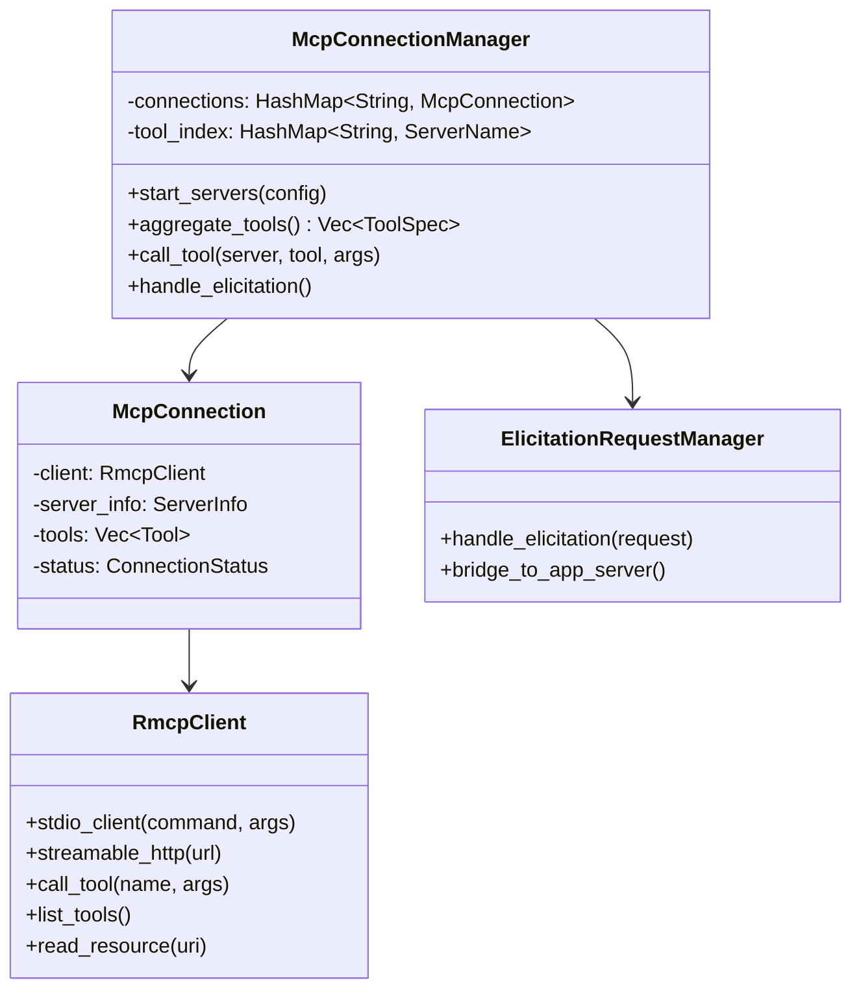

### 服务器配置

```toml
# config.toml
[mcp_servers.filesystem]
command = "npx"
args = ["-y", "@modelcontextprotocol/server-filesystem", "/path"]
env = { PATH = "/usr/bin" }

[mcp_servers.github]
url = "https://api.github.com/mcp"
auth = "oauth"

[mcp_servers.database]
command = "mcp-server-postgres"
args = ["postgres://localhost/mydb"]
```

### 工具聚合

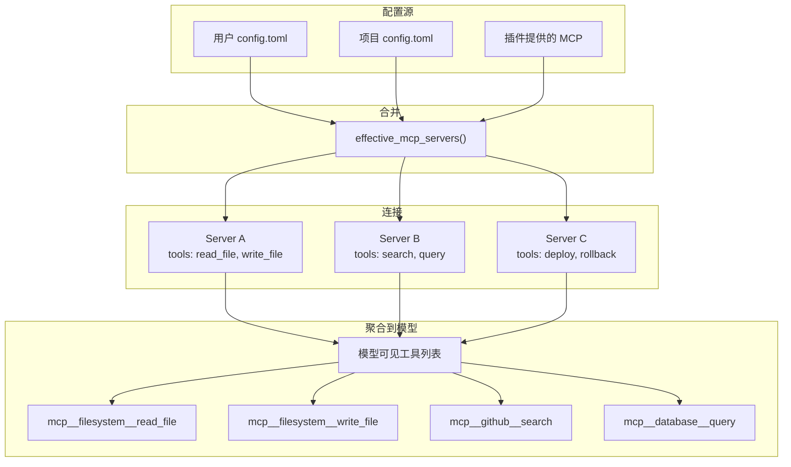

工具命名规则: `mcp__<server_name>__<tool_name>`

### 工具调用流程

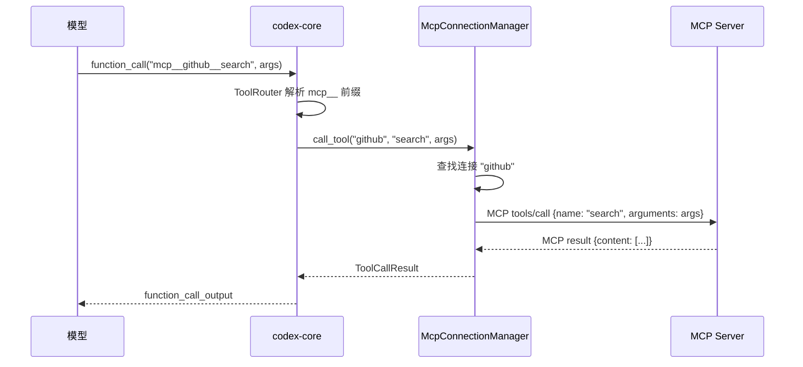

### 引出 (Elicitation) 桥接

当 MCP 服务器需要用户输入时：

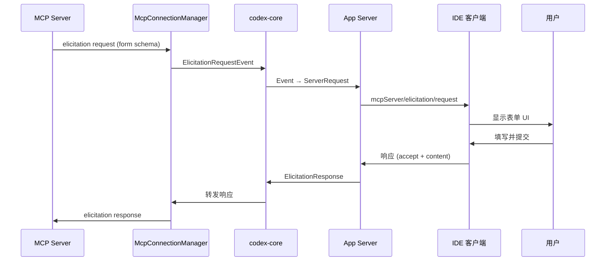

### 连接状态管理

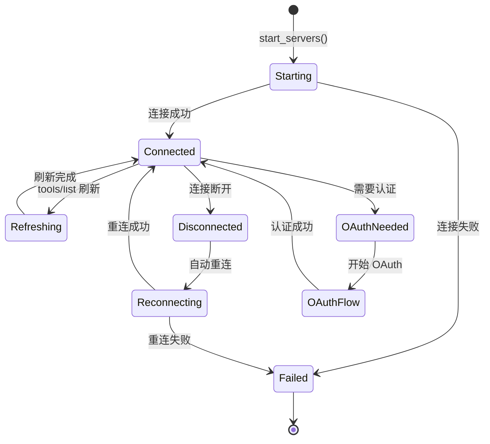

## 角色2: App Server MCP 管理

### 管理 API

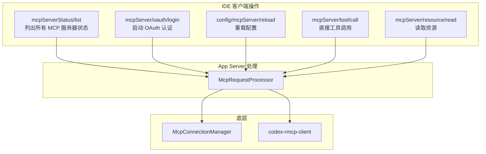

### 状态列表返回

```json
{
  "data": [
    {
      "name": "filesystem",
      "status": "connected",
      "tools": [
        {"name": "read_file", "description": "Read a file"},
        {"name": "write_file", "description": "Write to a file"}
      ],
      "resources": [],
      "authStatus": null
    },
    {
      "name": "github",
      "status": "auth_required",
      "tools": [],
      "resources": [],
      "authStatus": {
        "type": "oauth",
        "loginUrl": "https://github.com/login/oauth/..."
      }
    }
  ],
  "nextCursor": null
}
```

### OAuth 流程

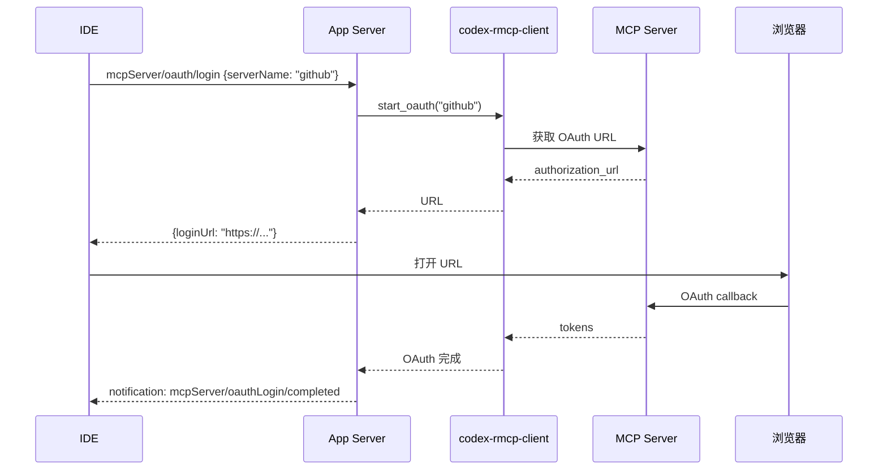

### 热重载

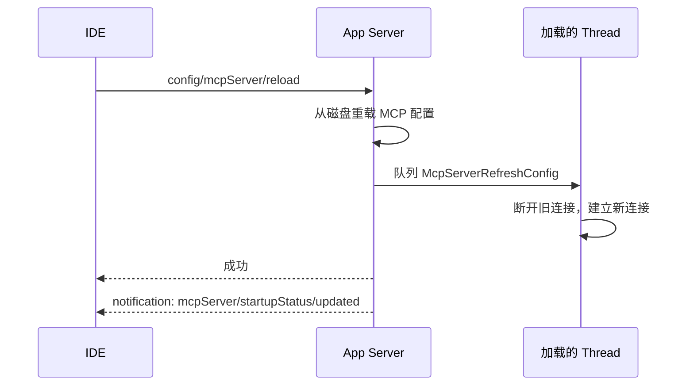

## 角色3: MCP 服务端 (codex-mcp-server)

### 作为 MCP 工具暴露

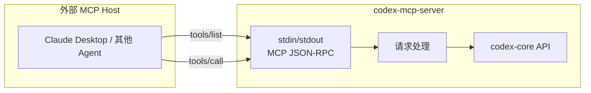

这是一个**独立二进制**，暴露 Codex 为 MCP 工具供其他系统调用。

注意：这与 App Server 协议完全不同——这里说的是真正的 MCP 协议。

### 启动方式

```bash
# 作为 MCP stdio 服务器运行
codex mcp-server

# 在其他工具的 MCP 配置中引用
# claude_desktop_config.json:
{
  "mcpServers": {
    "codex": {
      "command": "codex",
      "args": ["mcp-server"]
    }
  }
}
```

## RMCP 客户端 (codex-rmcp-client)

底层 MCP 通信实现：

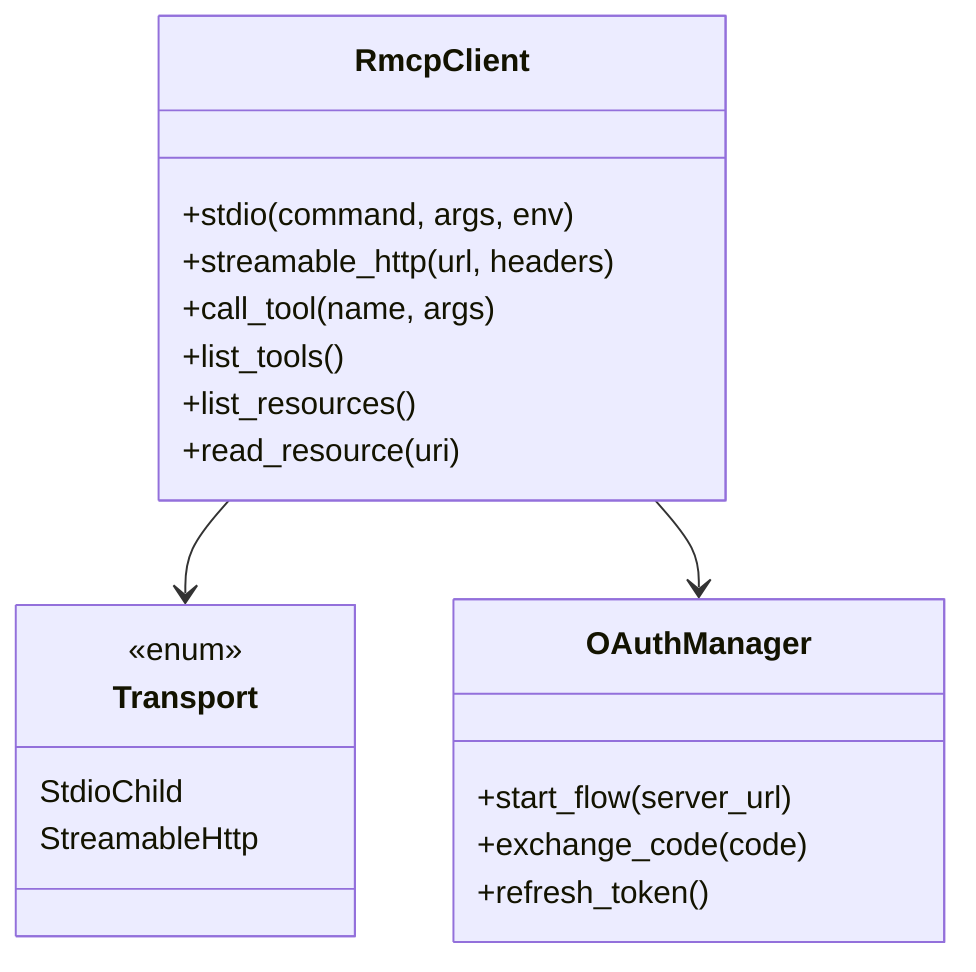

支持的传输方式：
- **Stdio** — 启动子进程，通过 stdin/stdout 通信
- **Streamable HTTP** — HTTP SSE 流式通信
- **OAuth** — 自动 token 管理和刷新

## MCP 在 Turn 中的集成点

```mermaid
flowchart TD
    subgraph "Turn 开始"
        START[Turn 启动] --> REFRESH[检查 MCP 刷新请求]
        REFRESH --> TOOLS[聚合所有 MCP 工具]
        TOOLS --> PROMPT[构建 Prompt (含 MCP 工具)]
    end

    subgraph "Turn 执行中"
        CALL[模型调用 MCP 工具] --> ROUTE[ToolRouter 路由]
        ROUTE --> MCP_CALL[McpConnectionManager.call_tool]
        MCP_CALL --> PROGRESS[发送进度事件]
        PROGRESS --> RESULT[返回结果给模型]
    end

    subgraph "事件通知"
        STARTUP["McpStartupUpdate<br/>(服务器启动状态)"]
        TOOL_BEGIN["McpToolCallBegin<br/>(开始调用)"]
        TOOL_PROGRESS["McpToolCallProgress<br/>(执行中)"]
        TOOL_END["McpToolCallEnd<br/>(调用完成)"]
    end

    START --> CALL
    CALL --> STARTUP
    MCP_CALL --> TOOL_BEGIN
    MCP_CALL --> TOOL_PROGRESS
    MCP_CALL --> TOOL_END
```

## 关键源文件

| 文件 | 说明 |
|------|------|
| `codex-mcp/src/connection_manager.rs` | MCP 连接管理器核心 |
| `codex-mcp/src/mcp_connection_manager.rs` | 工具变更管理 |
| `codex-rmcp-client/src/lib.rs` | RMCP SDK 客户端封装 |
| `codex-mcp-server/src/main.rs` | MCP 服务端入口 |
| `core/src/mcp.rs` | Core 中的 MCP 服务器解析 |
| `core/src/mcp_tool_call.rs` | MCP 工具调用处理 |
| `app-server-protocol/src/protocol/v2/mcp.rs` | MCP 管理 API 类型 |
| `protocol/src/mcp.rs` | 共享 MCP 类型 |
