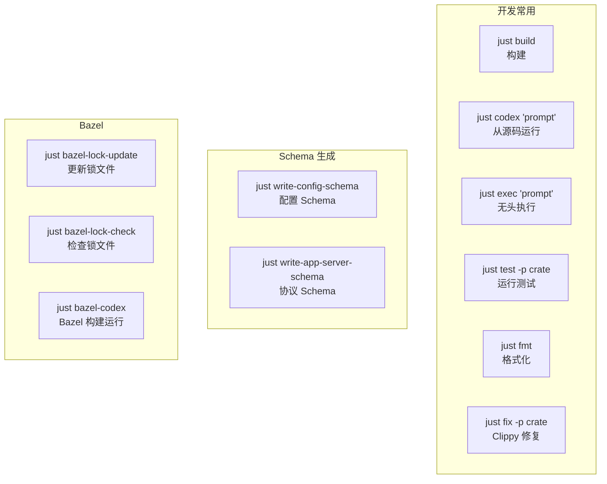
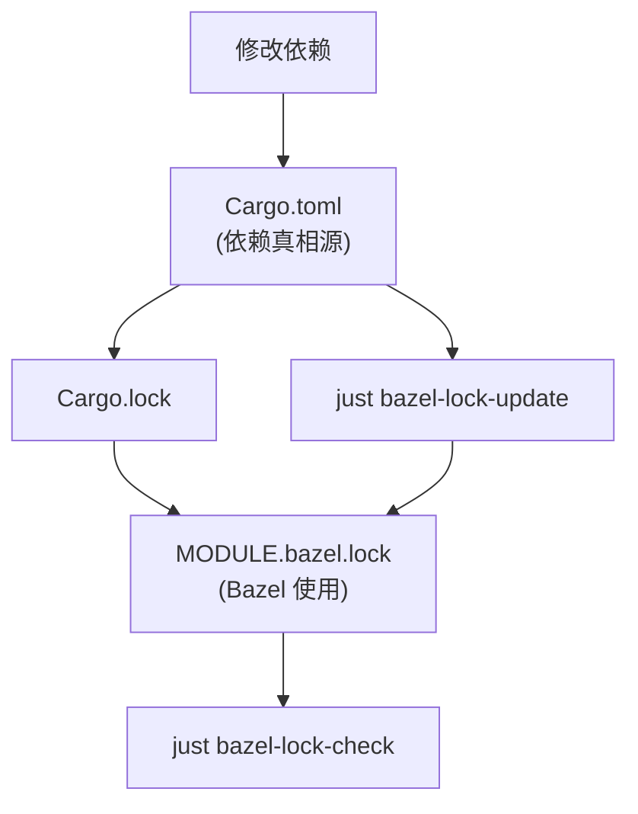
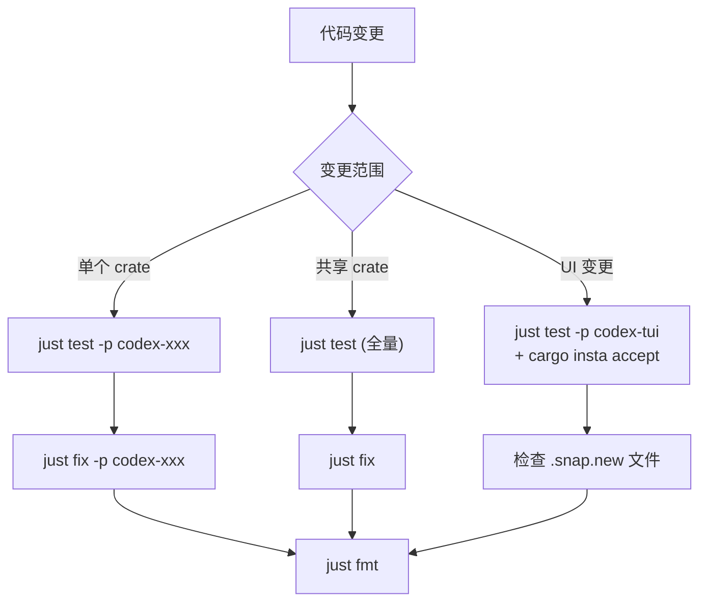
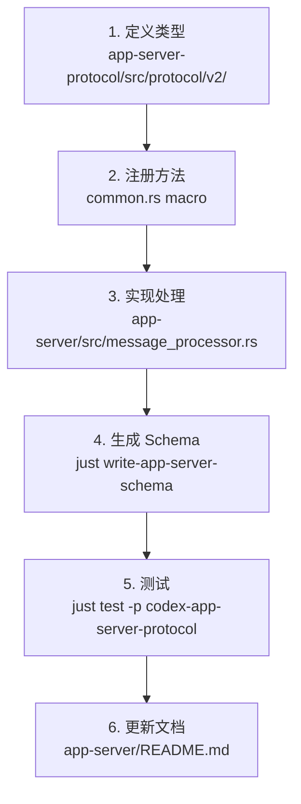
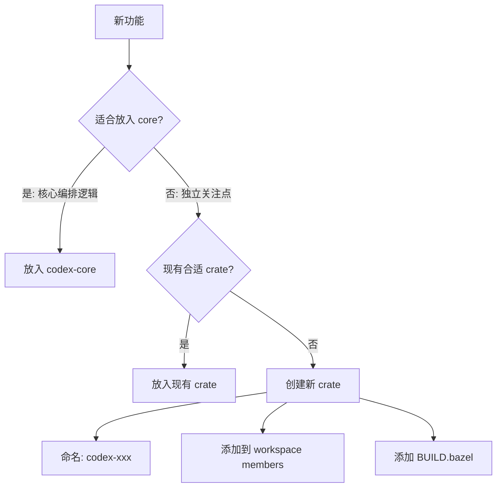
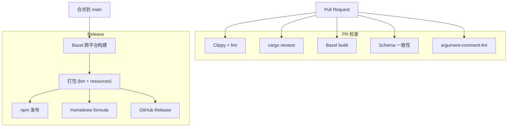

# 08 - 开发者指南

## 环境准备

### 系统要求

| 依赖 | 最低版本 | 安装 |
|------|----------|------|
| Rust | 1.93.0 | `rustup` (自动从 `rust-toolchain.toml`) |
| just | 最新 | `cargo install just` |
| cargo-nextest | 最新 | `cargo install cargo-nextest` |
| cargo-insta | 最新 | `cargo install --locked cargo-insta` |
| ripgrep (rg) | 最新 | 系统包管理器 |
| Node.js | ≥22 | 用于 npm 包开发 |
| pnpm | ≥10.33.0 | 用于 JS/TS 工作区 |

### 首次构建

```bash
cd codex-rs

# 构建所有 crate
cargo build

# 运行 Codex (从源码)
just codex "hello"

# 运行测试
just test -p codex-tui
```

## 构建系统

### Just 命令速查



### Cargo vs Bazel

| 方面 | Cargo | Bazel |
|------|-------|-------|
| 用途 | 日常开发 | CI/Release |
| 速度 | 增量快 | 首次慢，缓存后快 |
| 跨平台 | 本机 | 交叉编译 |
| 可重现 | 近似 | 确定性 |
| V8 | 不支持 | 完整支持 |
| 自定义 lint | 不支持 | `argument-comment-lint` |

### 双构建协同



## 代码规范

### Rust 风格

| 规则 | 示例 |
|------|------|
| 内联 format! 参数 | `format!("{name}")` 而非 `format!("{}", name)` |
| 折叠 if 语句 | 合并嵌套 `if` |
| 方法引用优于闭包 | `.map(String::as_str)` 而非 `.map(\|s\| s.as_str())` |
| 穷尽 match | 避免通配符臂 `_ =>` |
| 新 trait 需文档 | 解释角色和使用预期 |
| 避免 `#[async_trait]` | 使用 RPITIT: `fn foo() -> impl Future<Output=T> + Send` |
| 参数注释 lint | 不透明字面量前加 `/*param_name*/` |

### 模块大小限制

```
目标: < 500 LoC (不含测试)
警告: > 800 LoC → 新功能应放入新模块
特别注意:
  - codex-rs/tui/src/app.rs
  - codex-rs/tui/src/chatwidget.rs
  - codex-rs/tui/src/bottom_pane/mod.rs
```

### TUI 样式

```rust
// ✓ 推荐
"text".dim()
"text".red()
"text".cyan().underlined()
"text".into()  // 无样式 Span
vec![...].into()  // Line

// ✗ 避免
Span::styled("text", Style::default().fg(Color::Red))
"text".white()  // 不要硬编码白色，用默认前景
```

### Clippy 配置

项目使用严格的 Clippy 配置：

- `unwrap_used = deny` — 禁止 `.unwrap()`
- `print_stdout = deny` — 禁止直接打印
- `print_stderr = deny` — 禁止直接打印

## 测试指南

### 测试工作流



### 测试约定

```rust
// ✓ 使用 pretty_assertions
use pretty_assertions::assert_eq;

// ✓ 整体对象比较
assert_eq!(actual_config, expected_config);

// ✗ 避免逐字段比较
assert_eq!(config.model, "o4-mini");
assert_eq!(config.cwd, "/tmp");

// ✓ 查找二进制：使用 codex_utils_cargo_bin
let bin = codex_utils_cargo_bin::cargo_bin("codex");

// ✗ 避免
let bin = assert_cmd::Command::cargo_bin("codex");
```

### 快照测试 (insta)

```bash
# 1. 运行测试（生成 .snap.new）
just test -p codex-tui

# 2. 查看待审查
cargo insta pending-snapshots -p codex-tui

# 3. 预览具体文件
cargo insta show -p codex-tui path/to/file.snap.new

# 4. 接受所有
cargo insta accept -p codex-tui
```

### 集成测试模式

```rust
// 使用 core_test_support::responses
let mock = responses::mount_sse_once(&server, responses::sse(vec![
    responses::ev_response_created("resp-1"),
    responses::ev_function_call(call_id, "shell", &serde_json::to_string(&args)?),
    responses::ev_completed("resp-1"),
])).await;

codex.submit(Op::UserTurn { ... }).await?;

// 断言请求体
let request = mock.single_request();
```

## App Server 协议开发

### 添加新 RPC 方法



### 命名约定

```rust
// 方法名: resource/method (camelCase on wire)
"thread/start"
"mcpServer/tool/call"
"config/value/write"

// 类型名
struct ThreadStartParams { ... }     // 请求参数
struct ThreadStartResponse { ... }   // 响应
struct TurnCompletedNotification { ... }  // 通知
```

### v2 必须的注解

```rust
#[derive(Serialize, Deserialize, JsonSchema, TS)]
#[serde(rename_all = "camelCase")]
#[ts(export_to = "v2/")]
pub struct MyNewParams {
    pub thread_id: String,

    // C→S 请求参数中的可选字段
    #[ts(optional = nullable)]
    pub cursor: Option<String>,
}
```

## codex-core 开发注意

### 避免膨胀



### 什么应该放入 core

- Session 生命周期编排
- Turn 循环控制流
- 工具调用路由 (高层)
- 事件发射

### 什么不应该放入 core

- 具体工具实现 → `codex-tools`
- 沙箱策略逻辑 → `codex-sandboxing`
- 配置解析 → `codex-config`
- API 传输 → `codex-api`
- MCP 通信 → `codex-mcp`
- 文件操作 → `codex-file-system`

## 常见开发任务

### 添加新工具

1. 在 `codex-tools` 中定义工具 spec
2. 在 `core/src/tools/handlers/` 添加 handler
3. 在 `core/src/tools/spec_plan.rs` 注册（可能条件性）
4. 添加测试
5. 更新快照（如影响 UI）

### 修改配置

1. 修改 `codex-config` 中的 `ConfigToml` 类型
2. 运行 `just write-config-schema` 更新 JSON Schema
3. 在 `core/src/config/` 中处理新字段
4. 添加测试
5. 更新 `docs/config.md`

### 修改 App Server 协议

1. 修改 `app-server-protocol/src/protocol/v2/`
2. 注册新方法到 `common.rs`
3. 实现处理器
4. 运行 `just write-app-server-schema`
5. 运行 `just test -p codex-app-server-protocol`
6. 更新 `app-server/README.md`

### Bazel 相关变更

如果修改了 `Cargo.toml` 或 `Cargo.lock`：

```bash
# 更新 Bazel 锁文件
just bazel-lock-update

# 验证
just bazel-lock-check
```

如果添加了 `include_str!` / `include_bytes!`：
- 更新对应 crate 的 `BUILD.bazel` (`compile_data` 或 `build_script_data`)

## CI/CD 流程



## 发布包结构

```
codex-package/
├── bin/
│   └── codex[.exe]           # 主二进制
├── codex-resources/
│   ├── bwrap                  # Linux: 内嵌 bubblewrap
│   ├── zsh/                   # Shell 补全
│   └── windows-sandbox/       # Windows 沙箱辅助
├── codex-path/
│   └── rg                     # 内嵌 ripgrep
└── codex-package.json         # 包元数据
```

## 学习资源

| 资源 | 路径 | 说明 |
|------|------|------|
| 贡献指南 | `docs/contributing.md` | 贡献政策 |
| 构建文档 | `docs/install.md` | 从源码构建 |
| Bazel 文档 | `codex-rs/docs/bazel.md` | Bazel 工作流 |
| 配置参考 | `docs/config.md` | config.toml 完整参考 |
| 沙箱文档 | `docs/sandbox.md` | 沙箱详解 |
| 执行策略 | `docs/execpolicy.md` | 命令策略 |
| Skills | `docs/skills.md` | Skills 系统 |
| TUI 样式 | `codex-rs/tui/styles.md` | TUI 样式规范 |
| App Server | `codex-rs/app-server/README.md` | 协议文档 |
| AGENTS.md | 根目录 `AGENTS.md` | Agent/贡献者完整指南 |
