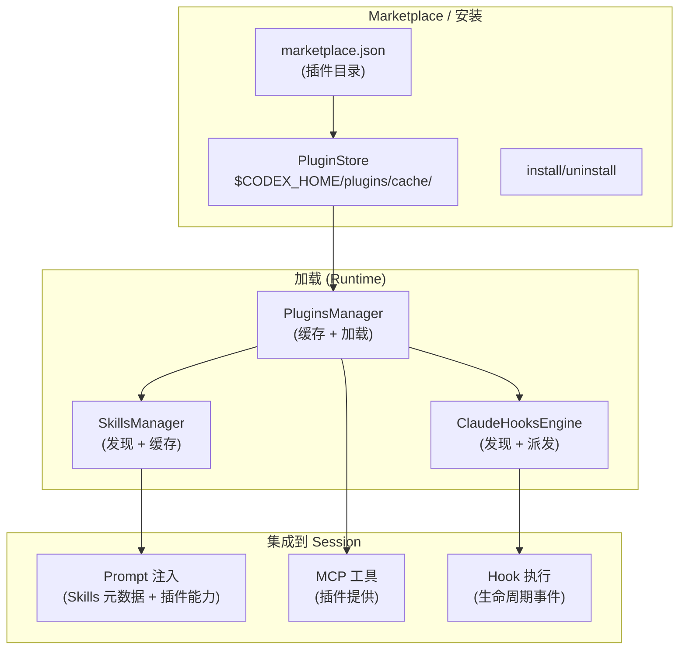
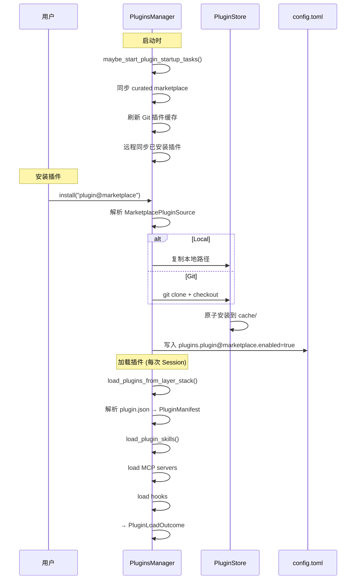
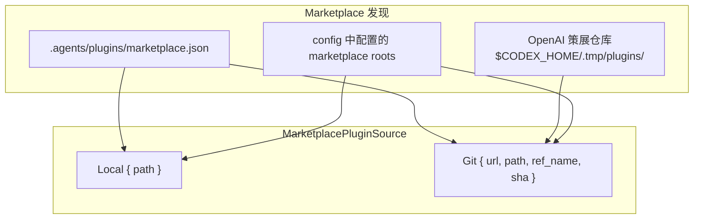
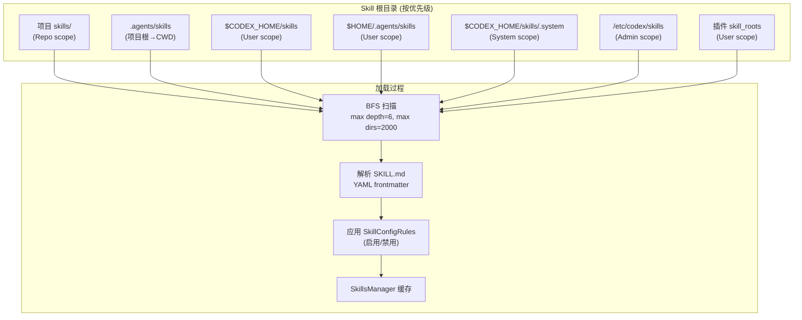
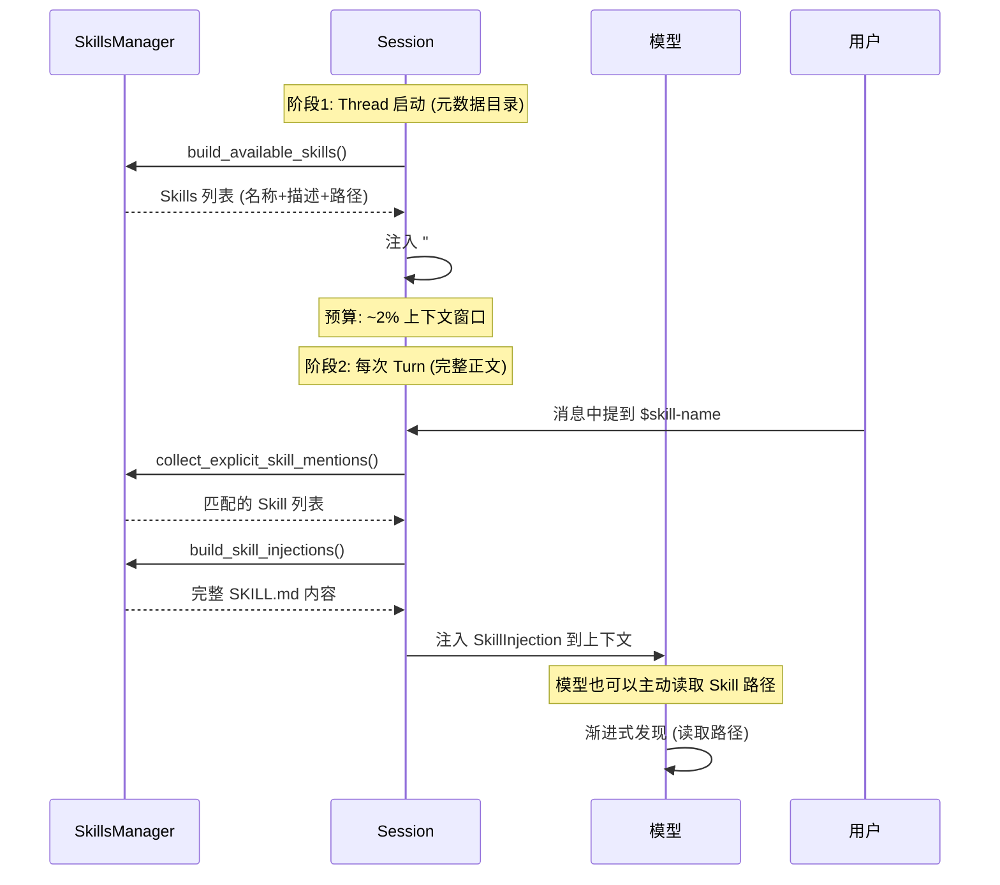
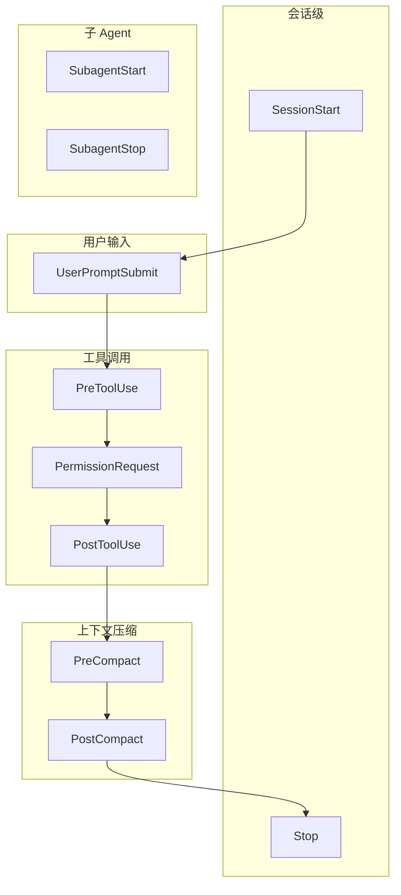
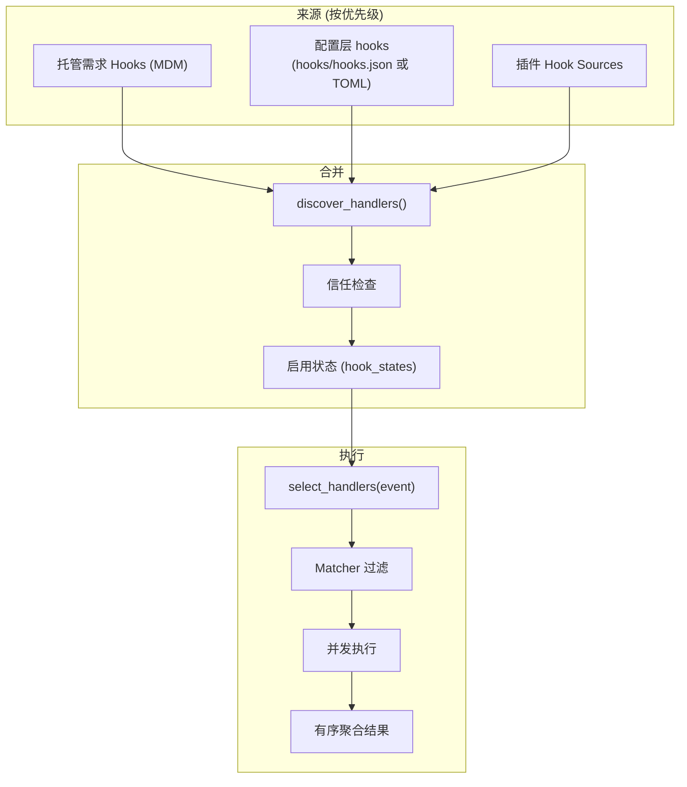
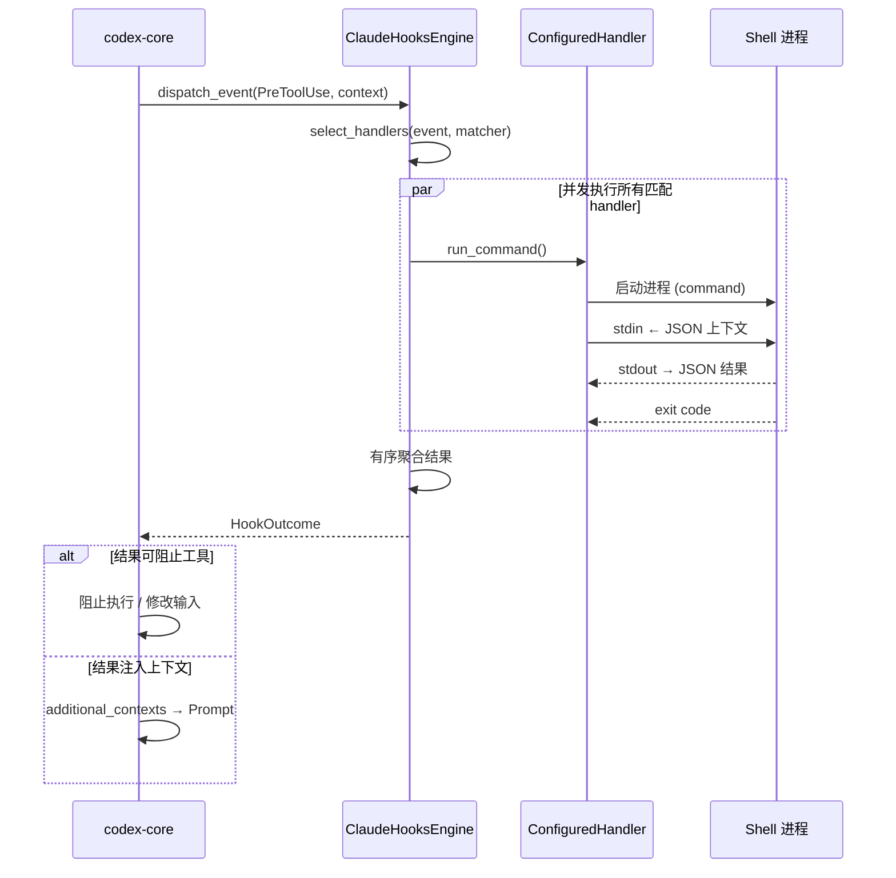
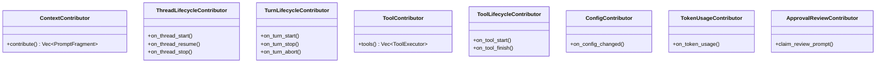
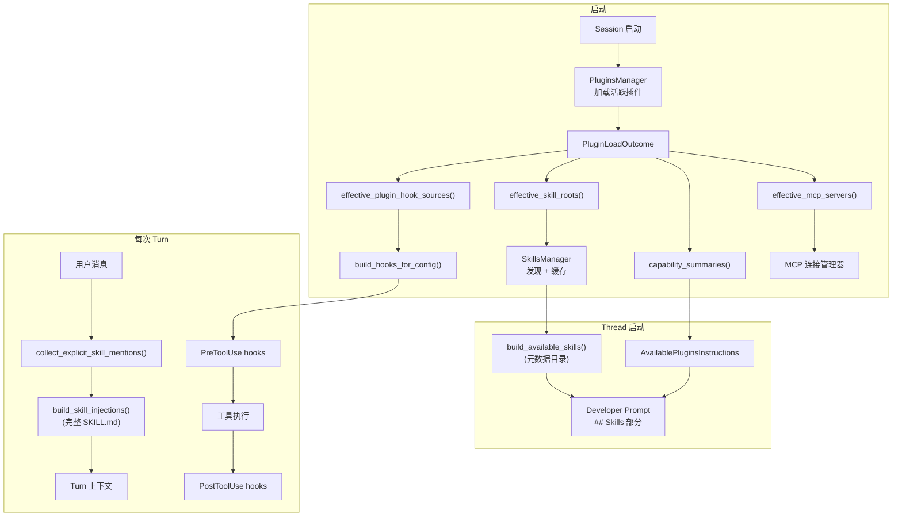

# 09 - 插件、Skills 与 Hooks 系统

## 整体架构



## 插件系统 (Plugin)

### 插件是什么？

插件是一个**文件系统目录**，包含：

```
my-plugin/
├── .codex-plugin/
│   └── plugin.json          # 插件清单 (必须)
├── skills/                   # 可选: 插件提供的 Skills
│   └── my-skill/
│       └── SKILL.md
├── .mcp.json                 # 可选: MCP 服务器配置
├── .app.json                 # 可选: App 连接器
└── hooks/
    └── hooks.json            # 可选: 生命周期 Hooks
```

### 插件生命周期



### 核心类型

```rust
// 插件标识
pub struct PluginId {
    pub plugin_name: String,
    pub marketplace_name: String,
}
// 格式: "plugin@marketplace"

// 加载结果
pub struct LoadedPlugin<M> {
    pub config_name: String,
    pub root: AbsolutePathBuf,
    pub enabled: bool,
    pub skill_roots: Vec<AbsolutePathBuf>,
    pub disabled_skill_paths: HashSet<AbsolutePathBuf>,
    pub mcp_servers: HashMap<String, M>,
    pub apps: Vec<AppConnectorId>,
    pub hook_sources: Vec<PluginHookSource>,
}

// 聚合结果 (所有活跃插件合并)
pub struct PluginLoadOutcome {
    // 提供:
    //   effective_plugin_skill_roots() → SkillsManager
    //   effective_mcp_servers() → MCP 连接管理器
    //   effective_apps() → App 连接器
    //   effective_plugin_hook_sources() → Hook 引擎
    //   capability_summaries() → Prompt + 遥测
}
```

### 插件来源



### 存储结构

```
$CODEX_HOME/plugins/
├── cache/
│   └── <marketplace>/
│       └── <plugin>/
│           └── <version>/      # 安装的插件内容
└── data/
    └── <plugin>-<marketplace>/ # 插件运行时数据
```

## Skills 系统

### Skill 是什么？

Skill 是一个包含 `SKILL.md` 的目录，为 Agent 提供特定知识或能力：

```
my-skill/
├── SKILL.md              # 必须: YAML frontmatter + markdown 正文
├── agents/
│   └── openai.yaml       # 可选: 接口、依赖、策略
├── scripts/              # 可选: 脚本资源
├── references/           # 可选: 参考文档
└── assets/               # 可选: 资产文件
```

### SKILL.md 格式

```markdown
---
name: my-awesome-skill
description: 一个示例 Skill 的描述
metadata:
  short-description: 简短描述 (用于列表显示)
---

# My Awesome Skill

这里是完整的 Skill 指导内容...
当 Agent 需要使用此 Skill 时，整个正文会被注入到上下文中。
```

### Skill 发现与加载



### 两阶段 Prompt 注入



### Skill 作用域优先级

```
Repo > User > System > Admin
(相同路径时，高优先级作用域胜出)
```

### 配置控制

```toml
# config.toml
[[skills.config]]
name = "dangerous-skill"
enabled = false

[[skills.config]]
path = "/path/to/specific/skill"
enabled = false
```

## Hook 系统

### Hook 是什么？

Hook 是在 Agent 生命周期特定事件触发的 Shell 命令：

```json
// hooks/hooks.json
{
  "hooks": [
    {
      "event": "PreToolUse",
      "matcher": { "tool_name": "shell.*" },
      "command": "./scripts/validate-command.sh",
      "timeout_ms": 5000
    },
    {
      "event": "Stop",
      "command": "notify-send 'Codex' 'Session ended'"
    }
  ]
}
```

### 生命周期事件



### 10 种事件类型

| 事件 | 触发时机 | 可阻止? |
|------|----------|---------|
| `SessionStart` | 会话/子Agent启动 | 否 |
| `UserPromptSubmit` | 用户消息提交前 | 否 |
| `PreToolUse` | 工具执行前 | **是** |
| `PermissionRequest` | 审批流程中 | **是** (Allow/Deny) |
| `PostToolUse` | 工具执行后 | 否 |
| `PreCompact` | 上下文压缩前 | 否 |
| `PostCompact` | 上下文压缩后 | 否 |
| `SubagentStart` | 子Agent启动 | 否 |
| `SubagentStop` | 子Agent停止 | 否 |
| `Stop` | Turn 结束 | 否 |

### Hook 发现



### Hook 执行机制



### Hook 结果能力

| 能力 | 适用事件 | 说明 |
|------|----------|------|
| 阻止工具执行 | PreToolUse | 返回 block 决策 |
| 修改工具输入 | PreToolUse | 返回修改后的参数 |
| Allow/Deny 审批 | PermissionRequest | 提前决定审批结果 |
| 注入上下文 | 任意 | `additional_contexts` 字段 |
| 停止会话 | Stop | 清理操作 |

### 插件 Hooks 环境变量

插件提供的 Hook 会获得额外环境变量：

```
PLUGIN_ROOT      → 插件安装根目录
PLUGIN_DATA_ROOT → 插件数据目录
```

## Extension API (编译时扩展)

### 与插件的区别

| 特性 | 插件 (Plugin) | 扩展 (Extension) |
|------|---------------|------------------|
| 形式 | 文件系统目录 | Rust crate |
| 发现 | 运行时 marketplace | 编译时链接 |
| 能力 | Skills + MCP + Hooks | 完整贡献者 trait |
| 用户安装 | 是 | 否 (内置) |
| 示例 | 社区工具 | goal, memories, guardian |

### 贡献者 Traits



### 注册模式

```rust
// 在 codex-core 启动时
let mut builder = ExtensionRegistryBuilder::<Config>::new();

// 注册各扩展
memories::install(&mut builder);
goal::install(&mut builder, goal_config);
guardian::install(&mut builder);

let registry = builder.build();
// registry 存储在 SessionServices 中
```

### 内置扩展

| 扩展 | Crate | 功能 |
|------|-------|------|
| **Goal** | `ext/goal` | 线程目标追踪、预算核算、`update_goal` 工具 |
| **Memories** | `ext/memories` | 记忆读取工具、developer prompt 注入 |
| **Guardian** | `ext/guardian` | 通过 AgentSpawner 产生子Agent 审核 |

## 端到端数据流



## 关键源文件

| 模块 | 文件 |
|------|------|
| 插件标识 | `plugin/src/plugin_id.rs` |
| 插件加载结果 | `plugin/src/load_outcome.rs` |
| 插件管理器 | `core-plugins/src/manager.rs` |
| 插件存储 | `core-plugins/src/store.rs` |
| 插件清单 | `core-plugins/src/manifest.rs` |
| Marketplace | `core-plugins/src/marketplace.rs` |
| Skill 模型 | `core-skills/src/model.rs` |
| Skill 加载器 | `core-skills/src/loader.rs` |
| Skill 管理器 | `core-skills/src/manager.rs` |
| Skill 注入 | `core-skills/src/injection.rs` |
| Skill 渲染 | `core-skills/src/render.rs` |
| Hook 引擎 | `hooks/src/engine/mod.rs` |
| Hook 发现 | `hooks/src/engine/discovery.rs` |
| Hook 派发 | `hooks/src/engine/dispatcher.rs` |
| Extension API | `ext/extension-api/src/contributors.rs` |
| Extension 注册 | `ext/extension-api/src/registry.rs` |
| Core Hook 集成 | `core/src/hook_runtime.rs` |
| Core Skill 集成 | `core/src/skills.rs` |
