# 10 - 模型提供商与记忆系统

## 模型提供商架构

### 分层设计

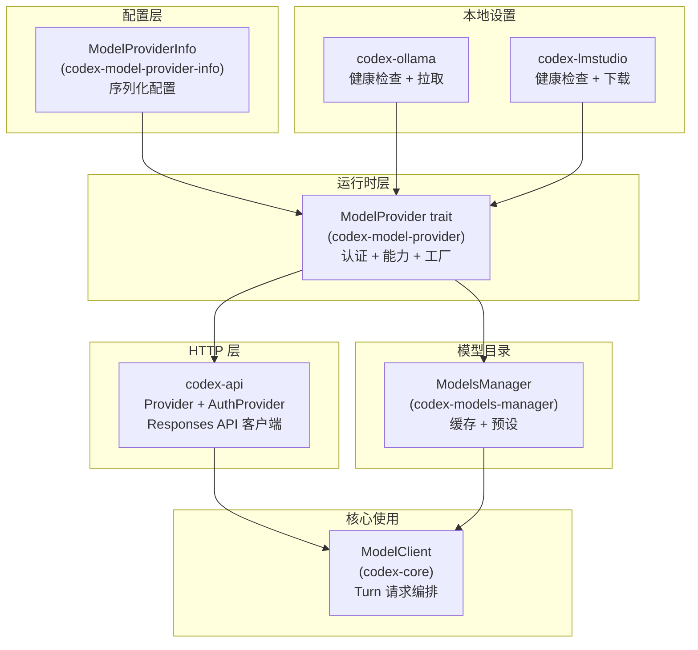

### ModelProvider Trait

```rust
pub trait ModelProvider: fmt::Debug + Send + Sync {
    fn info(&self) -> &ModelProviderInfo;
    fn capabilities(&self) -> ProviderCapabilities;
    fn auth_manager(&self) -> Option<Arc<AuthManager>>;
    async fn auth(&self) -> Option<CodexAuth>;
    fn account_state(&self) -> ProviderAccountResult;
    async fn api_provider(&self) -> Result<Provider>;
    async fn runtime_base_url(&self) -> Result<Option<String>>;
    async fn api_auth(&self) -> Result<SharedAuthProvider>;
    fn models_manager(...) -> SharedModelsManager;
}
```

### 内置提供商

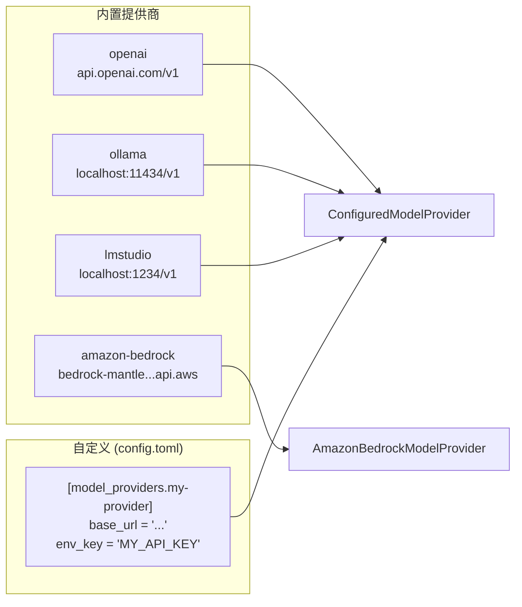

### ModelProviderInfo 配置

```rust
pub struct ModelProviderInfo {
    // 身份
    pub name: String,
    pub base_url: String,

    // 认证
    pub env_key: Option<String>,          // 环境变量 API key
    pub auth: Option<AuthCommand>,        // 外部命令获取 bearer
    pub aws: Option<AwsConfig>,           // SigV4 配置
    pub requires_openai_auth: bool,       // 需要 OpenAI 登录

    // 传输
    pub wire_api: WireApi,                // 仅 Responses
    pub supports_websockets: bool,

    // HTTP 调优
    pub query_params: HashMap<String, String>,
    pub http_headers: HashMap<String, String>,
    pub request_max_retries: Option<u32>,
    pub stream_max_retries: Option<u32>,
    pub stream_idle_timeout_ms: Option<u64>,
    pub websocket_connect_timeout_ms: Option<u64>,
}
```

### 认证解析优先级

```mermaid
flowchart TD
    START[api_auth() 调用] --> ENV{env_key 设置?}
    ENV -->|是| BEARER_ENV["BearerAuthProvider(env值)"]
    ENV -->|否| TOKEN{experimental_bearer_token?}
    TOKEN -->|是| BEARER_TOKEN["BearerAuthProvider(token)"]
    TOKEN -->|否| CMD{auth command 配置?}
    CMD -->|是| CMD_AUTH["外部命令 AuthManager"]
    CMD -->|否| LOGIN{CodexAuth 已登录?}
    LOGIN -->|是| CODEX_AUTH["API Key / ChatGPT Auth"]
    LOGIN -->|否| UNAUTH["UnauthenticatedAuthProvider<br/>(本地 OSS)"]
```

### 能力标志

```rust
pub struct ProviderCapabilities {
    pub namespace_tools: bool,      // 工具命名空间
    pub image_generation: bool,     // 图片生成
    pub web_search: bool,           // Web 搜索
}

// OpenAI: 全部 true
// Bedrock: 全部 false
// OSS: 默认 false
```

## 模型目录管理

### ModelInfo 元数据

```rust
pub struct ModelInfo {
    pub slug: String,                    // 模型标识
    pub display_name: String,            // 显示名
    pub context_window: Option<i64>,     // 上下文窗口
    pub max_context_window: Option<i64>, // 最大上下文
    pub auto_compact_token_limit: Option<i64>,

    // 能力
    pub supports_reasoning_summaries: bool,
    pub supports_parallel_tool_calls: bool,
    pub supports_search_tool: bool,
    pub input_modalities: Vec<InputModality>,

    // 推理
    pub default_reasoning_level: Option<ReasoningEffort>,
    pub supported_reasoning_levels: Vec<ReasoningEffortPreset>,

    // 工具
    pub shell_type: ConfigShellToolType,
    pub experimental_supported_tools: Vec<String>,

    // 其他
    pub truncation_policy: TruncationPolicyConfig,
    pub priority: i32,
    pub visibility: ModelVisibility,
}
```

### 目录获取策略

```mermaid
graph TD
    PROVIDER[ModelProvider] --> CHECK{有 config_model_catalog?}

    CHECK -->|是| STATIC["StaticModelsManager<br/>(配置中硬编码)"]
    CHECK -->|否| REMOTE["OpenAiModelsManager"]

    REMOTE --> CACHE{磁盘缓存有效?<br/>(TTL 5min)}
    CACHE -->|是| USE_CACHE["使用缓存"]
    CACHE -->|否| FETCH["GET /models"]
    FETCH --> SAVE["保存到<br/>~/.codex/models_cache.json"]

    STATIC --> RESULT[ModelInfo 列表]
    USE_CACHE --> RESULT
    SAVE --> RESULT
```

## Ollama 集成

### 工作原理

Ollama **不是**独立的 `ModelProvider` 实现——它是一个内置的 `ModelProviderInfo` 条目加上启动检查客户端。

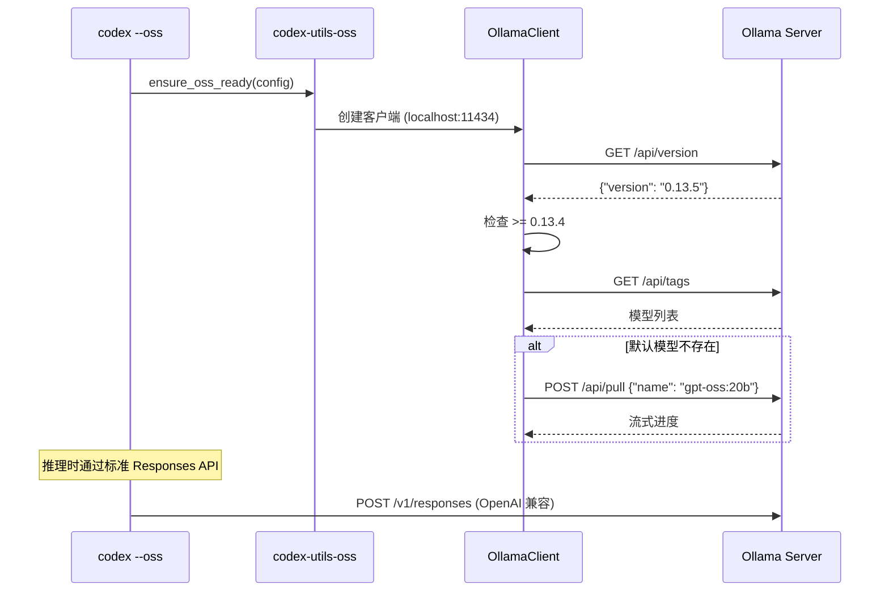

### 版本要求

- **最低版本**: 0.13.4 (Responses API 支持)
- **默认模型**: `gpt-oss:20b`
- **兼容检测**: 检查 base_url 是否以 `/v1` 结尾

## LM Studio 集成

### 工作原理

与 Ollama 类似的模式：

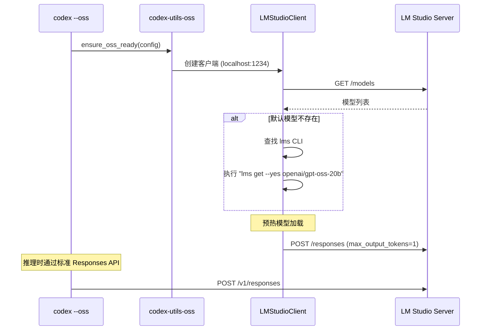

### 区别

| 特性 | Ollama | LM Studio |
|------|--------|-----------|
| 默认端口 | 11434 | 1234 |
| 版本检查 | 是 (≥0.13.4) | 否 |
| 模型拉取 | HTTP API | CLI 命令 (`lms`) |
| 预热 | 否 | 是 (POST /responses) |
| 默认模型 | gpt-oss:20b | openai/gpt-oss-20b |

## 统一设计理念

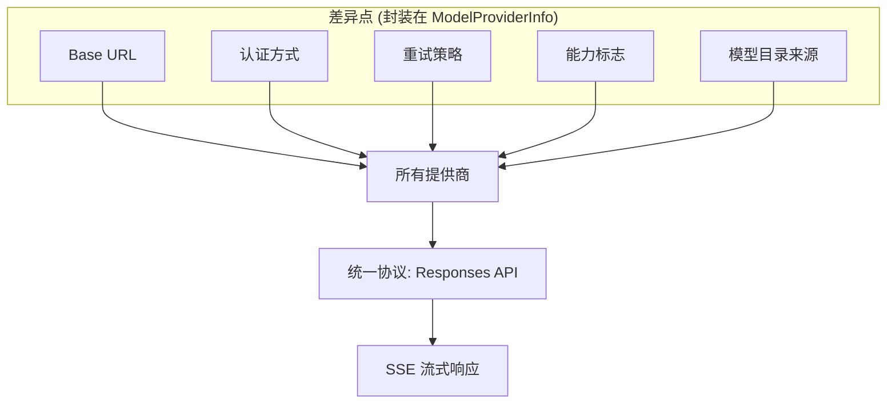

**核心设计**: 一个线上协议 (Responses API) 适配所有后端。提供商差异限定在 URL、认证、重试调优、能力标志和模型目录来源。

---

## 记忆系统 (Memories)

### 概述

记忆系统让 Codex 能**跨会话积累知识**，通过两阶段管道将会话经验提炼为持久化的结构化记忆。

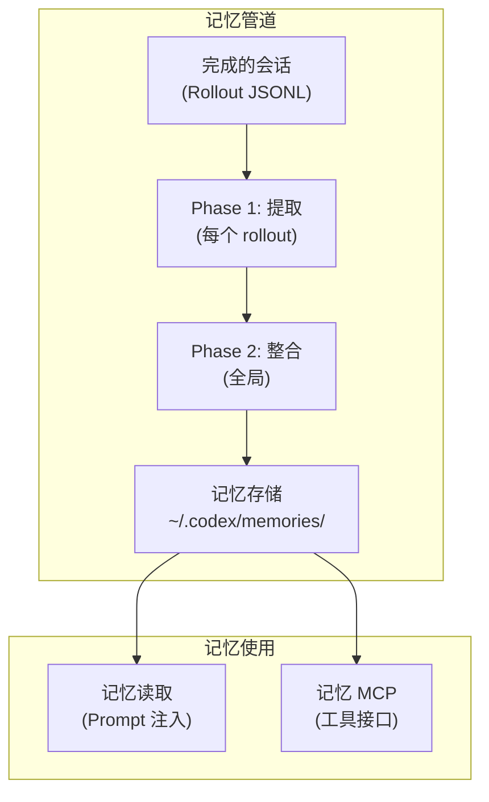

### 存储结构

```
~/.codex/memories/
├── .git/                        # Git 基线 (跟踪变更)
├── MEMORY.md                    # 主记忆文档 (Agent 整理)
├── memory_summary.md            # 摘要 (注入 Prompt)
├── raw_memories.md              # 原始提取的记忆
├── rollout_summaries/
│   ├── fix-auth-bug.md          # 每个 rollout 的摘要
│   └── add-dark-mode.md
└── skills/                      # Agent 自动生成的 Skills
```

### Phase 1: 每 Rollout 提取

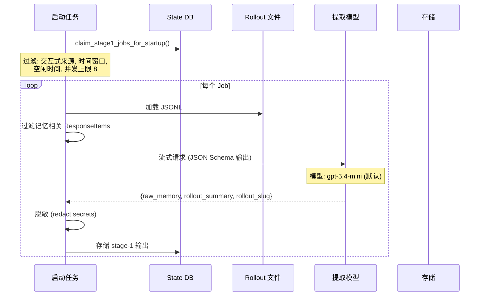

### Phase 2: 全局整合

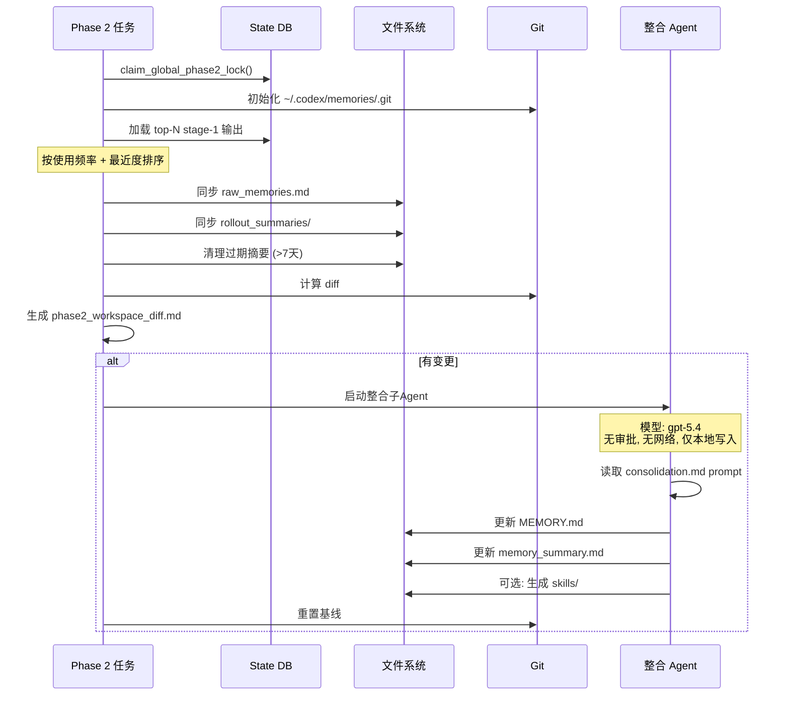

### 记忆读取

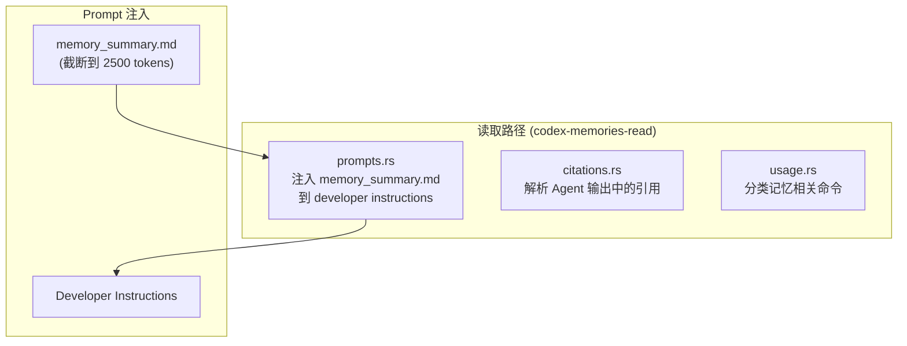

### 记忆 MCP 服务器

`codex-memories-mcp` 提供只读 MCP 工具：

| 工具 | 说明 |
|------|------|
| `list` | 列出记忆文件 |
| `read` | 读取特定记忆 |
| `search` | 搜索记忆内容 |

### 触发条件

记忆管道在以下条件下启动：

1. 非临时会话 (`--ephemeral` 时不启动)
2. `Feature::MemoryTool` 启用
3. 是根 Agent (非子 Agent)
4. State DB 可用

### 关键配置

```toml
# config.toml
[memories]
extract_model = "gpt-5.4-mini"  # Phase 1 提取模型
```

## Responses API 交互

### 请求结构

```rust
pub struct ResponsesApiRequest {
    pub model: String,
    pub instructions: Option<String>,
    pub input: Vec<ResponseItem>,       // 对话历史
    pub tools: Vec<ToolSpec>,           // 工具声明
    pub reasoning: Option<ReasoningConfig>,
    pub text: Option<TextConfig>,       // 输出格式
    pub store: bool,                    // 是否存储
    pub stream: bool,                   // 流式
    // ...
}
```

### 流式响应事件

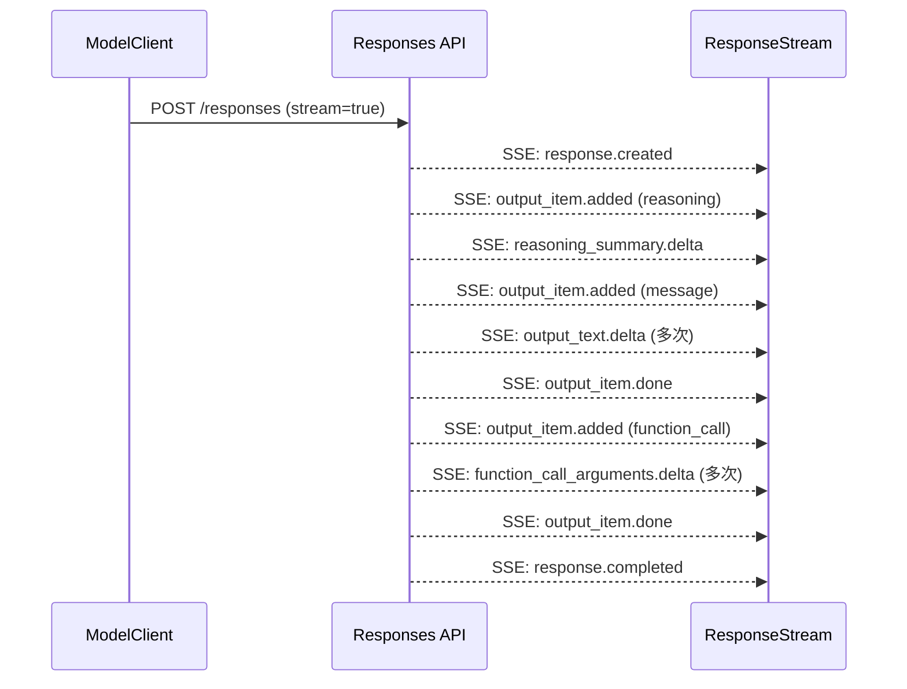

### ResponseEvent 枚举

```rust
pub enum ResponseEvent {
    Created { response_id: String },
    OutputItemAdded { item: ResponseItem },
    OutputTextDelta { text: String },
    ReasoningSummaryDelta { text: String },
    FunctionCallArgumentsDelta { text: String },
    OutputItemDone { item: ResponseItem },
    Completed { response_id, token_usage, end_turn },
    RateLimits { ... },
    ServerModel { model: String },
    Failed { error: ApiError },
}
```

### 传输选择

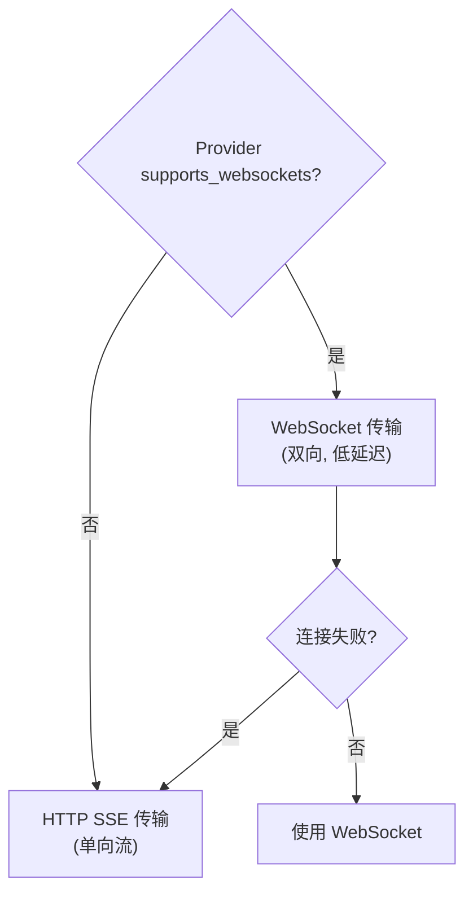

### 核心 ModelClient 编排

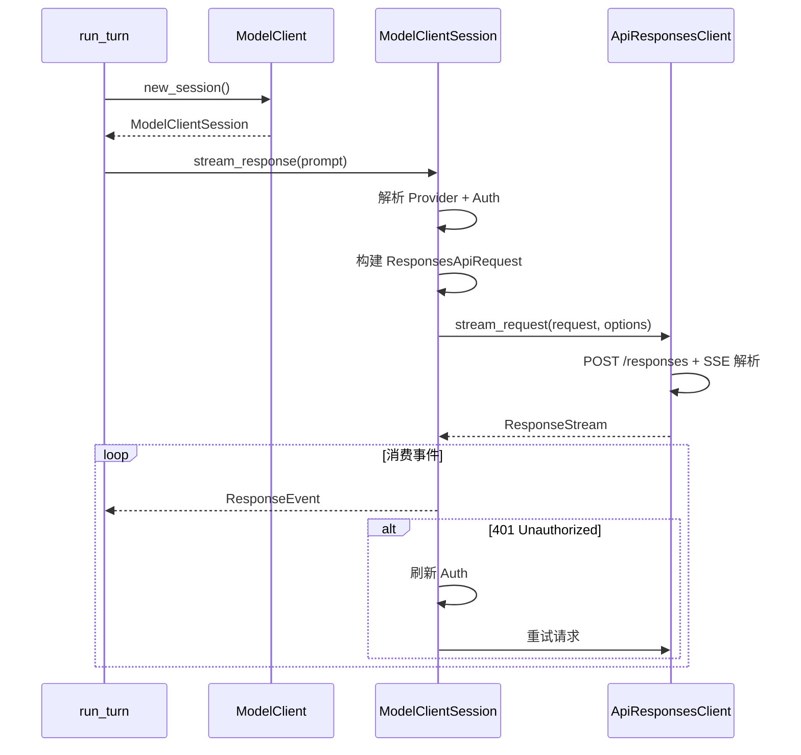

## 关键源文件

| 模块 | 文件 |
|------|------|
| Provider trait | `model-provider/src/provider.rs` |
| Provider 配置 | `model-provider-info/src/lib.rs` |
| 认证解析 | `model-provider/src/auth.rs` |
| Bedrock 实现 | `model-provider/src/amazon_bedrock/mod.rs` |
| Models 端点 | `model-provider/src/models_endpoint.rs` |
| 模型元数据 | `protocol/src/openai_models.rs` |
| 模型缓存 | `models-manager/src/manager.rs` |
| Ollama 客户端 | `ollama/src/client.rs` |
| LM Studio 客户端 | `lmstudio/src/client.rs` |
| OSS 编排 | `utils/oss/src/lib.rs` |
| Responses 客户端 | `codex-api/src/endpoint/responses.rs` |
| SSE 解析 | `codex-api/src/sse/responses.rs` |
| Core ModelClient | `core/src/client.rs` |
| 记忆启动 | `memories/write/src/start.rs` |
| Phase 1 提取 | `memories/write/src/phase1.rs` |
| Phase 2 整合 | `memories/write/src/phase2.rs` |
| 记忆读取 | `memories/read/src/lib.rs` |
| 记忆 MCP | `memories/mcp/src/server.rs` |
