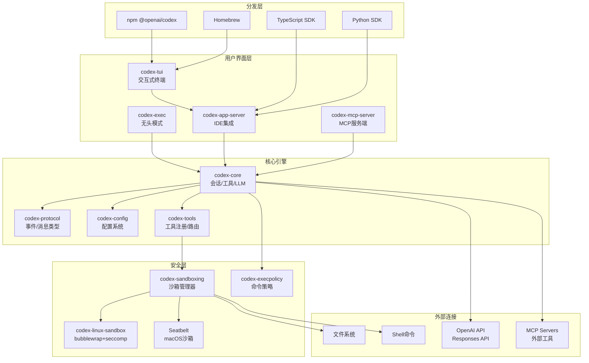
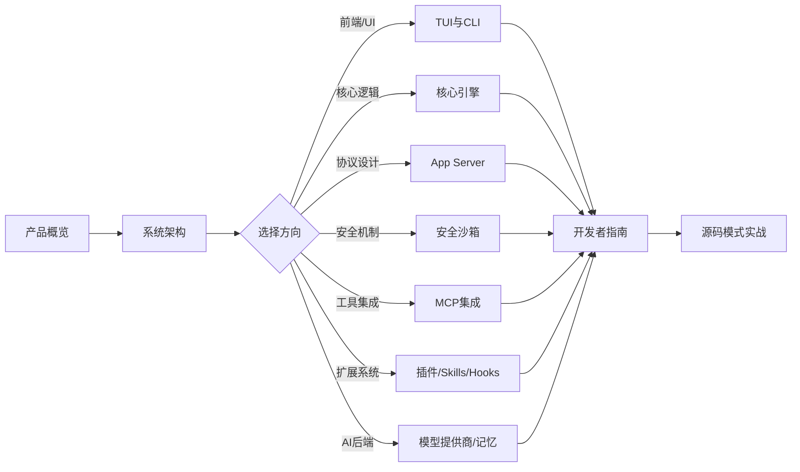

# Codex 项目全面学习指南

> OpenAI Codex CLI — 一个运行在本地的 AI 编程代理，可读写代码、执行命令、集成 IDE。

## 文档索引

| # | 文档 | 视角 | 内容概要 |
|---|------|------|----------|
| 01 | [产品概览](./01-product-overview.md) | 产品/用户 | 产品定位、核心功能、用户价值、竞品分析 |
| 02 | [系统架构](./02-architecture.md) | 设计/架构 | 整体架构、Crate 依赖图、数据流、设计决策 |
| 03 | [核心引擎](./03-core-engine.md) | 开发者 | Session/Turn 模型、事件系统、工具执行、LLM 交互 |
| 04 | [TUI 与 CLI](./04-tui-and-cli.md) | 开发者/用户 | 终端界面架构、命令行接口、渲染系统 |
| 05 | [App Server 协议](./05-app-server-protocol.md) | 设计/开发者 | JSON-RPC 协议、消息流、IDE 集成 |
| 06 | [安全沙箱](./06-security-sandbox.md) | 设计/开发者 | 沙箱机制、权限模型、审批流程 |
| 07 | [MCP 集成](./07-mcp-integration.md) | 开发者 | Model Context Protocol、工具聚合、双向通信 |
| 08 | [开发者指南](./08-developer-guide.md) | 开发者 | 构建系统、测试、贡献指南、代码规范 |
| 09 | [插件、Skills 与 Hooks](./09-plugins-skills-hooks.md) | 设计/开发者 | 插件生命周期、Skill 注入、Hook 系统、Extension API |
| 10 | [模型提供商与记忆](./10-model-providers-memories.md) | 设计/开发者 | 多模型支持、Ollama/LM Studio、记忆管道 |
| 11 | [源码模式与实战](./11-source-code-patterns.md) | 开发者 | 10大核心实现模式、真实代码示例 |

## 快速导航

### 我是产品经理 / 想了解这个项目是什么

→ 从 [01-产品概览](./01-product-overview.md) 开始

### 我是架构师 / 想了解整体设计

→ 从 [02-系统架构](./02-architecture.md) 开始，然后看 [06-安全沙箱](./06-security-sandbox.md)

### 我是开发者 / 想参与开发

→ 从 [08-开发者指南](./08-developer-guide.md) 开始，然后按需查看具体模块

### 我是用户 / 想了解如何使用

→ 从 [01-产品概览](./01-product-overview.md) 开始，然后看 [04-TUI与CLI](./04-tui-and-cli.md)

## 项目快照

```
项目名称: Codex CLI (OpenAI)
主要语言: Rust (113 个 Crate)
构建系统: Cargo + Bazel (双构建)
分发方式: npm (@openai/codex) / Homebrew / GitHub Releases
许可证:   Apache-2.0
```

## 核心架构一览



## 学习路线建议


